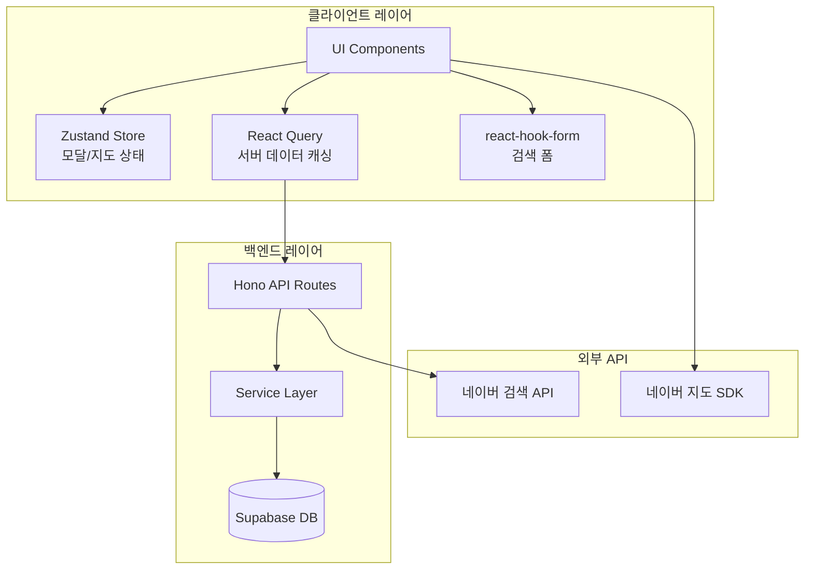
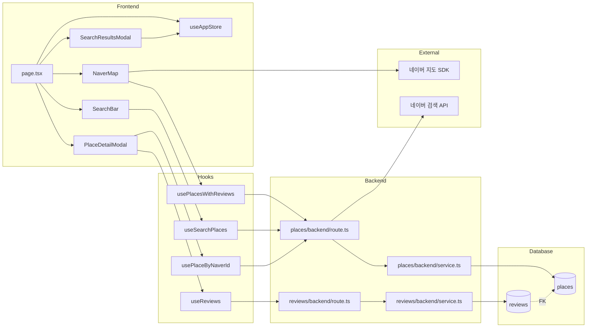
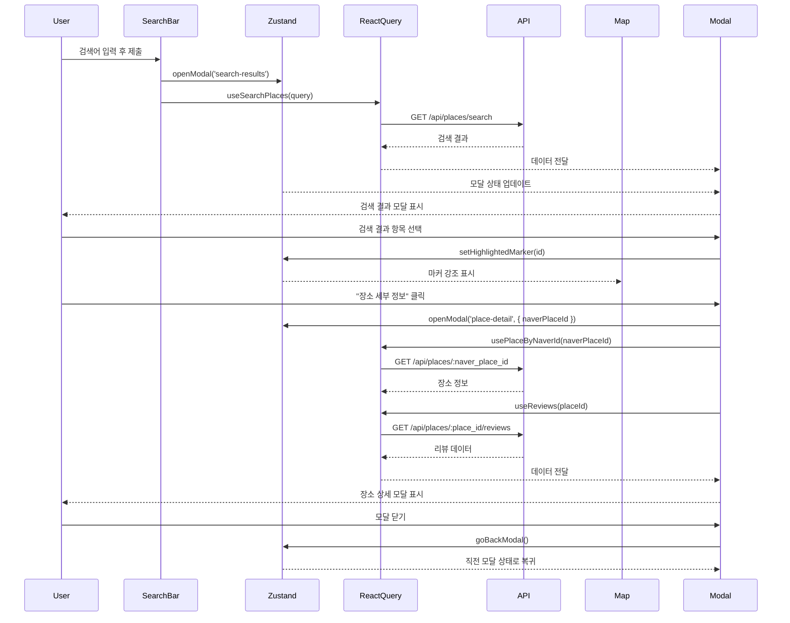

# UC-001: 장소 검색 및 정보 확인 - 구현 계획

## 1. Feature Overview

### 1.1 목표
네이버 지도 SDK와 검색 API를 활용하여 사용자가 음식점을 검색하고, 지도에서 마커로 확인하며, 상세 정보와 리뷰를 조회할 수 있는 기능을 구현합니다.

### 1.2 주요 기능
- 네이버 장소 검색 API를 통한 음식점 검색
- 검색 결과 리스트 표시 및 지도 마커 연동
- 장소 세부 정보 모달 (업체 정보, 평균 별점, 리뷰 목록)
- 리뷰가 있는 장소의 커스텀 마커 표시
- 모달 네비게이션 (검색 결과 ↔ 장소 상세 ↔ 메인 지도)

### 1.3 기술 스택
- **프론트엔드**: Next.js 14 App Router, React 18, TypeScript
- **상태 관리**: Zustand (모달/UI), React Query (서버 데이터), react-hook-form (검색 폼)
- **백엔드**: Hono (API Router), Supabase (Database)
- **외부 API**: 네이버 지도 SDK, 네이버 검색 API
- **스키마 검증**: Zod
- **UI 컴포넌트**: shadcn-ui, Tailwind CSS

---

## 2. Technical Architecture

### 2.1 시스템 아키텍처



### 2.2 상태 관리 계층

```
┌─────────────────────────────────────────────────┐
│         Zustand (Global UI State)               │
│  - modalState: 'closed' | 'search-results' |    │
│                'place-detail'                    │
│  - modalHistory: ModalHistoryItem[]             │
│  - highlightedMarkerId: string | null           │
│  - mapCenter: { lat, lng }                      │
└─────────────────────────────────────────────────┘
                      ↓
┌─────────────────────────────────────────────────┐
│       React Query (Server State)                │
│  - places/with-reviews (지도 마커용)             │
│  - places/search?query={keyword}                │
│  - places/:naverPlaceId                         │
│  - places/:placeId/reviews                      │
└─────────────────────────────────────────────────┘
                      ↓
┌─────────────────────────────────────────────────┐
│       react-hook-form (Form State)              │
│  - searchQuery: string                          │
└─────────────────────────────────────────────────┘
```

### 2.3 컴포넌트 구조

```
src/app/page.tsx (메인 페이지)
  ├── SearchBar (검색 폼)
  ├── NaverMap (지도 컴포넌트)
  │   └── PlaceMarker[] (마커 컴포넌트)
  ├── SearchResultsModal (검색 결과 모달)
  │   └── SearchResultItem[] (검색 결과 항목)
  └── PlaceDetailModal (장소 상세 모달)
      ├── PlaceInfo (장소 정보)
      ├── ReviewStats (평균 별점, 리뷰 개수)
      └── ReviewList (리뷰 목록)
          └── ReviewItem[] (리뷰 항목)
```

---

## 3. Implementation Plan

### 3.1 개요: 모듈 및 작업 위치

| 모듈 | 경로 | 설명 |
|------|------|------|
| **백엔드 API** | `src/features/places/backend/` | 장소 검색, 조회 API |
| **백엔드 API** | `src/features/reviews/backend/` | 리뷰 조회 API |
| **Zustand Store** | `src/stores/useAppStore.ts` | 모달 및 지도 상태 관리 |
| **React Query Hooks** | `src/features/places/hooks/` | 장소 검색, 조회 훅 |
| **React Query Hooks** | `src/features/reviews/hooks/` | 리뷰 조회 훅 |
| **UI Components** | `src/features/places/components/` | 지도, 검색, 모달 컴포넌트 |
| **네이버 SDK 설정** | `src/app/layout.tsx` | 네이버 지도 SDK 스크립트 로드 |
| **메인 페이지** | `src/app/page.tsx` | 지도 및 모달 통합 페이지 |
| **Database Migration** | `supabase/migrations/0002_create_places_and_reviews.sql` | places, reviews 테이블 생성 |

### 3.2 Diagram: 모듈 간 관계



---

## 4. API Specifications

### 4.1 Backend API Endpoints

#### 1) GET /api/places/search

**목적**: 네이버 장소 검색 API를 프록시하여 검색 결과 반환

**요청**
```typescript
GET /api/places/search?query=강남+맛집&display=5
```

**요청 스키마** (`src/features/places/backend/schema.ts`)
```typescript
export const SearchPlacesQuerySchema = z.object({
  query: z.string().min(1, '검색어를 입력해주세요'),
  display: z.coerce.number().int().min(1).max(5).default(5),
});

export type SearchPlacesQuery = z.infer<typeof SearchPlacesQuerySchema>;
```

**응답 스키마**
```typescript
export const NaverPlaceSchema = z.object({
  id: z.string(), // 네이버 place_id
  name: z.string(),
  address: z.string(),
  roadAddress: z.string().optional(),
  phone: z.string().optional(),
  latitude: z.number(),
  longitude: z.number(),
  category: z.string().optional(),
});

export const SearchPlacesResponseSchema = z.object({
  places: z.array(NaverPlaceSchema),
  total: z.number(),
});

export type NaverPlace = z.infer<typeof NaverPlaceSchema>;
export type SearchPlacesResponse = z.infer<typeof SearchPlacesResponseSchema>;
```

**응답 예시**
```json
{
  "ok": true,
  "data": {
    "places": [
      {
        "id": "naver_12345678",
        "name": "강남 맛집",
        "address": "서울시 강남구 역삼동",
        "roadAddress": "서울시 강남구 테헤란로 123",
        "phone": "02-1234-5678",
        "latitude": 37.498095,
        "longitude": 127.027610,
        "category": "음식점>한식"
      }
    ],
    "total": 1
  }
}
```

#### 2) GET /api/places/:naver_place_id

**목적**: 네이버 장소 ID로 places 테이블 조회 또는 생성

**요청**
```typescript
GET /api/places/naver_12345678
```

**요청 스키마**
```typescript
export const PlaceParamsSchema = z.object({
  naver_place_id: z.string().min(1),
});

export type PlaceParams = z.infer<typeof PlaceParamsSchema>;
```

**응답 스키마**
```typescript
export const PlaceResponseSchema = z.object({
  id: z.string().uuid(),
  naver_place_id: z.string(),
  name: z.string(),
  address: z.string(),
  phone: z.string().nullable(),
  latitude: z.number(),
  longitude: z.number(),
  created_at: z.string(),
  updated_at: z.string(),
});

export type PlaceResponse = z.infer<typeof PlaceResponseSchema>;
```

**처리 로직**:
1. places 테이블에서 naver_place_id로 조회
2. 존재하면 해당 데이터 반환
3. 없으면 네이버 검색 API로 장소 정보 조회 후 places 테이블에 INSERT 후 반환

#### 3) GET /api/places/with-reviews

**목적**: 리뷰가 존재하는 모든 장소 조회 (지도 마커 표시용)

**요청**
```typescript
GET /api/places/with-reviews
```

**응답 스키마**
```typescript
export const PlacesWithReviewsResponseSchema = z.array(
  z.object({
    id: z.string().uuid(),
    naver_place_id: z.string(),
    name: z.string(),
    latitude: z.number(),
    longitude: z.number(),
  })
);

export type PlacesWithReviewsResponse = z.infer<typeof PlacesWithReviewsResponseSchema>;
```

**SQL**
```sql
SELECT DISTINCT p.id, p.naver_place_id, p.name, p.latitude, p.longitude
FROM places p
INNER JOIN reviews r ON p.id = r.place_id;
```

#### 4) GET /api/places/:place_id/reviews

**목적**: 특정 장소의 리뷰 목록 및 통계 조회

**요청**
```typescript
GET /api/places/uuid-1234/reviews
```

**요청 스키마**
```typescript
export const ReviewsParamsSchema = z.object({
  place_id: z.string().uuid(),
});

export type ReviewsParams = z.infer<typeof ReviewsParamsSchema>;
```

**응답 스키마** (`src/features/reviews/backend/schema.ts`)
```typescript
export const ReviewSchema = z.object({
  id: z.string().uuid(),
  place_id: z.string().uuid(),
  author_name: z.string(),
  rating: z.number().int().min(1).max(5),
  content: z.string(),
  created_at: z.string(),
});

export const ReviewStatsSchema = z.object({
  avg_rating: z.number().min(0).max(5),
  review_count: z.number().int().min(0),
});

export const ReviewsResponseSchema = z.object({
  place_id: z.string().uuid(),
  reviews: z.array(ReviewSchema),
  stats: ReviewStatsSchema,
});

export type Review = z.infer<typeof ReviewSchema>;
export type ReviewStats = z.infer<typeof ReviewStatsSchema>;
export type ReviewsResponse = z.infer<typeof ReviewsResponseSchema>;
```

**SQL**
```sql
-- 리뷰 목록 조회
SELECT id, place_id, author_name, rating, content, created_at
FROM reviews
WHERE place_id = $1
ORDER BY created_at DESC;

-- 평균 별점 및 개수
SELECT
  COALESCE(AVG(rating), 0) as avg_rating,
  COUNT(*) as review_count
FROM reviews
WHERE place_id = $1;
```

---

## 5. State Management Details

### 5.1 Zustand Store (`src/stores/useAppStore.ts`)

```typescript
import { create } from 'zustand';

type ModalState = 'closed' | 'search-results' | 'place-detail';

interface ModalHistoryItem {
  type: Exclude<ModalState, 'closed'>;
  data?: {
    placeId?: string;
    naverPlaceId?: string;
    searchQuery?: string;
  };
}

interface AppState {
  // Modal 관리
  modalState: ModalState;
  modalHistory: ModalHistoryItem[];
  openModal: (type: Exclude<ModalState, 'closed'>, data?: ModalHistoryItem['data']) => void;
  closeModal: () => void;
  goBackModal: () => void;

  // Map 관리
  highlightedMarkerId: string | null;
  mapCenter: { lat: number; lng: number };
  setHighlightedMarker: (id: string | null) => void;
  setMapCenter: (lat: number, lng: number) => void;
}

export const useAppStore = create<AppState>((set, get) => ({
  // 초기 상태
  modalState: 'closed',
  modalHistory: [],
  highlightedMarkerId: null,
  mapCenter: { lat: 37.498095, lng: 127.027610 }, // 강남역

  // Modal Actions
  openModal: (type, data) =>
    set((state) => ({
      modalState: type,
      modalHistory: [...state.modalHistory, { type, data }],
    })),

  closeModal: () =>
    set({
      modalState: 'closed',
      modalHistory: [],
      highlightedMarkerId: null,
    }),

  goBackModal: () =>
    set((state) => {
      const newHistory = [...state.modalHistory];
      newHistory.pop();
      const prevModal = newHistory[newHistory.length - 1];

      return {
        modalState: prevModal?.type || 'closed',
        modalHistory: newHistory,
      };
    }),

  // Map Actions
  setHighlightedMarker: (id) => set({ highlightedMarkerId: id }),
  setMapCenter: (lat, lng) => set({ mapCenter: { lat, lng } }),
}));
```

### 5.2 React Query Hooks

#### `src/features/places/hooks/usePlaces.ts`

```typescript
import { useQuery } from '@tanstack/react-query';
import { apiClient } from '@/lib/remote/api-client';
import type { PlacesWithReviewsResponse, PlaceResponse, SearchPlacesResponse } from '../lib/dto';

// 리뷰가 있는 장소 목록 조회 (지도 마커용)
export const usePlacesWithReviews = () => {
  return useQuery({
    queryKey: ['places', 'with-reviews'],
    queryFn: async () => {
      const response = await apiClient.get<{ ok: boolean; data: PlacesWithReviewsResponse }>(
        '/api/places/with-reviews'
      );
      return response.data.data;
    },
    staleTime: 5 * 60 * 1000, // 5분
  });
};

// 네이버 장소 검색
export const useSearchPlaces = (query: string, enabled: boolean = true) => {
  return useQuery({
    queryKey: ['places', 'search', query],
    queryFn: async () => {
      const response = await apiClient.get<{ ok: boolean; data: SearchPlacesResponse }>(
        '/api/places/search',
        { params: { query, display: 5 } }
      );
      return response.data.data;
    },
    enabled: !!query && enabled,
    staleTime: 1 * 60 * 1000, // 1분
  });
};

// 네이버 장소 ID로 조회 또는 생성
export const usePlaceByNaverId = (naverPlaceId: string | null) => {
  return useQuery({
    queryKey: ['places', 'naver', naverPlaceId],
    queryFn: async () => {
      const response = await apiClient.get<{ ok: boolean; data: PlaceResponse }>(
        `/api/places/${naverPlaceId}`
      );
      return response.data.data;
    },
    enabled: !!naverPlaceId,
    staleTime: 10 * 60 * 1000, // 10분
  });
};
```

#### `src/features/reviews/hooks/useReviews.ts`

```typescript
import { useQuery } from '@tanstack/react-query';
import { apiClient } from '@/lib/remote/api-client';
import type { ReviewsResponse } from '../lib/dto';

export const useReviews = (placeId: string | null) => {
  return useQuery({
    queryKey: ['reviews', placeId],
    queryFn: async () => {
      const response = await apiClient.get<{ ok: boolean; data: ReviewsResponse }>(
        `/api/places/${placeId}/reviews`
      );
      return response.data.data;
    },
    enabled: !!placeId,
    staleTime: 30 * 1000, // 30초
  });
};
```

### 5.3 react-hook-form 검색 폼

```typescript
// src/features/places/components/SearchBar.tsx
'use client';

import { useForm } from 'react-hook-form';
import { zodResolver } from '@hookform/resolvers/zod';
import { z } from 'zod';
import { useAppStore } from '@/stores/useAppStore';

const searchFormSchema = z.object({
  query: z.string().min(1, '검색어를 입력해주세요'),
});

type SearchFormData = z.infer<typeof searchFormSchema>;

export const SearchBar = () => {
  const openModal = useAppStore((state) => state.openModal);

  const form = useForm<SearchFormData>({
    resolver: zodResolver(searchFormSchema),
    defaultValues: { query: '' },
  });

  const onSubmit = (data: SearchFormData) => {
    openModal('search-results', { searchQuery: data.query });
  };

  return (
    <form onSubmit={form.handleSubmit(onSubmit)}>
      {/* 검색 입력 필드 */}
    </form>
  );
};
```

---

## 6. Component Hierarchy

### 6.1 페이지 구조

```typescript
// src/app/page.tsx
'use client';

import { SearchBar } from '@/features/places/components/SearchBar';
import { NaverMap } from '@/features/places/components/NaverMap';
import { SearchResultsModal } from '@/features/places/components/SearchResultsModal';
import { PlaceDetailModal } from '@/features/places/components/PlaceDetailModal';

export default function HomePage() {
  return (
    <div className="h-screen flex flex-col">
      <SearchBar />
      <NaverMap />
      <SearchResultsModal />
      <PlaceDetailModal />
    </div>
  );
}
```

### 6.2 컴포넌트 목록

| 컴포넌트 | 경로 | 책임 |
|----------|------|------|
| `SearchBar` | `src/features/places/components/SearchBar.tsx` | 검색 폼, 검색 실행 |
| `NaverMap` | `src/features/places/components/NaverMap.tsx` | 네이버 지도 SDK 래핑, 마커 표시 |
| `PlaceMarker` | `src/features/places/components/PlaceMarker.tsx` | 개별 마커 컴포넌트 |
| `SearchResultsModal` | `src/features/places/components/SearchResultsModal.tsx` | 검색 결과 모달 |
| `SearchResultItem` | `src/features/places/components/SearchResultItem.tsx` | 검색 결과 개별 항목 |
| `PlaceDetailModal` | `src/features/places/components/PlaceDetailModal.tsx` | 장소 상세 모달 |
| `PlaceInfo` | `src/features/places/components/PlaceInfo.tsx` | 장소 정보 표시 |
| `ReviewStats` | `src/features/reviews/components/ReviewStats.tsx` | 평균 별점, 리뷰 개수 |
| `ReviewList` | `src/features/reviews/components/ReviewList.tsx` | 리뷰 목록 |
| `ReviewItem` | `src/features/reviews/components/ReviewItem.tsx` | 리뷰 개별 항목 |

### 6.3 데이터 흐름



---

## 7. Error Handling

### 7.1 Backend Error Codes

#### `src/features/places/backend/error.ts`

```typescript
export const placeErrorCodes = {
  searchError: 'PLACE_SEARCH_ERROR',
  naverApiError: 'NAVER_API_ERROR',
  fetchError: 'PLACE_FETCH_ERROR',
  notFound: 'PLACE_NOT_FOUND',
  validationError: 'PLACE_VALIDATION_ERROR',
  createError: 'PLACE_CREATE_ERROR',
} as const;

export type PlaceServiceError = keyof typeof placeErrorCodes;
```

#### `src/features/reviews/backend/error.ts`

```typescript
export const reviewErrorCodes = {
  fetchError: 'REVIEW_FETCH_ERROR',
  validationError: 'REVIEW_VALIDATION_ERROR',
} as const;

export type ReviewServiceError = keyof typeof reviewErrorCodes;
```

### 7.2 에러 처리 전략

| 에러 케이스 | HTTP 상태 | 에러 코드 | 처리 방법 |
|------------|----------|----------|----------|
| 검색 결과 없음 | 200 | - | `places: [], total: 0` 반환 |
| 네이버 API 호출 실패 | 500 | `NAVER_API_ERROR` | 에러 메시지 표시 |
| 장소 조회 실패 | 404 | `PLACE_NOT_FOUND` | "존재하지 않는 장소입니다" 표시 |
| 리뷰 없음 | 200 | - | `reviews: [], stats: { avg_rating: 0, review_count: 0 }` |
| 데이터베이스 오류 | 500 | `FETCH_ERROR` | "정보를 불러오는 중 오류가 발생했습니다" |
| 검증 오류 | 400 | `VALIDATION_ERROR` | 상세 검증 오류 메시지 표시 |

### 7.3 프론트엔드 에러 처리

```typescript
// src/features/places/components/SearchResultsModal.tsx
'use client';

import { useAppStore } from '@/stores/useAppStore';
import { useSearchPlaces } from '../hooks/usePlaces';

export const SearchResultsModal = () => {
  const modalState = useAppStore((state) => state.modalState);
  const modalHistory = useAppStore((state) => state.modalHistory);

  const currentModal = modalHistory[modalHistory.length - 1];
  const searchQuery = currentModal?.data?.searchQuery || '';

  const { data, isLoading, isError, error } = useSearchPlaces(
    searchQuery,
    modalState === 'search-results'
  );

  if (isError) {
    return (
      <div>
        <p>검색에 실패했습니다.</p>
        <p>{error instanceof Error ? error.message : '다시 시도해주세요'}</p>
      </div>
    );
  }

  if (data?.places.length === 0) {
    return <div>검색 결과가 없습니다</div>;
  }

  // 정상 렌더링
};
```

---

## 8. Testing Strategy

### 8.1 Unit Tests

#### Backend Service Tests

**`src/features/places/backend/__tests__/service.test.ts`**

```typescript
import { describe, it, expect, vi } from 'vitest';
import { getPlaceByNaverId, searchPlaces } from '../service';

describe('places/service', () => {
  describe('searchPlaces', () => {
    it('네이버 API 호출 성공 시 변환된 데이터를 반환한다', async () => {
      // Given: Mock fetch
      global.fetch = vi.fn().mockResolvedValue({
        ok: true,
        json: async () => ({
          items: [
            {
              title: '<b>강남</b> 맛집',
              address: '서울시 강남구',
              mapx: '1270276100',
              mapy: '374980950',
            },
          ],
          total: 1,
        }),
      });

      // When
      const result = await searchPlaces('강남 맛집', 5);

      // Then
      expect(result.ok).toBe(true);
      if (result.ok) {
        expect(result.data.places).toHaveLength(1);
        expect(result.data.places[0].name).toBe('강남 맛집');
        expect(result.data.places[0].latitude).toBeCloseTo(37.498095, 5);
      }
    });

    it('네이버 API 호출 실패 시 에러를 반환한다', async () => {
      // Given
      global.fetch = vi.fn().mockResolvedValue({
        ok: false,
        status: 500,
      });

      // When
      const result = await searchPlaces('강남 맛집', 5);

      // Then
      expect(result.ok).toBe(false);
      if (!result.ok) {
        expect(result.error.code).toBe('NAVER_API_ERROR');
      }
    });
  });

  describe('getPlaceByNaverId', () => {
    it('places 테이블에 데이터가 있으면 반환한다', async () => {
      // Given: Mock Supabase client
      const mockSupabase = {
        from: vi.fn().mockReturnValue({
          select: vi.fn().mockReturnValue({
            eq: vi.fn().mockReturnValue({
              maybeSingle: vi.fn().mockResolvedValue({
                data: {
                  id: 'uuid-1',
                  naver_place_id: 'naver_123',
                  name: '강남 맛집',
                  address: '서울시 강남구',
                  phone: '02-1234-5678',
                  latitude: 37.498095,
                  longitude: 127.027610,
                  created_at: '2025-10-22T00:00:00Z',
                  updated_at: '2025-10-22T00:00:00Z',
                },
                error: null,
              }),
            }),
          }),
        }),
      };

      // When
      const result = await getPlaceByNaverId(mockSupabase as any, 'naver_123');

      // Then
      expect(result.ok).toBe(true);
      if (result.ok) {
        expect(result.data.name).toBe('강남 맛집');
      }
    });
  });
});
```

#### React Query Hook Tests

**`src/features/places/hooks/__tests__/usePlaces.test.ts`**

```typescript
import { renderHook, waitFor } from '@testing-library/react';
import { QueryClient, QueryClientProvider } from '@tanstack/react-query';
import { usePlacesWithReviews } from '../usePlaces';

const createWrapper = () => {
  const queryClient = new QueryClient({
    defaultOptions: { queries: { retry: false } },
  });

  return ({ children }: { children: React.ReactNode }) => (
    <QueryClientProvider client={queryClient}>{children}</QueryClientProvider>
  );
};

describe('usePlacesWithReviews', () => {
  it('리뷰가 있는 장소 목록을 성공적으로 조회한다', async () => {
    // When
    const { result } = renderHook(() => usePlacesWithReviews(), {
      wrapper: createWrapper(),
    });

    // Then
    await waitFor(() => expect(result.current.isSuccess).toBe(true));
    expect(result.current.data).toBeDefined();
  });
});
```

### 8.2 Integration Tests

#### API Route Tests

**`src/features/places/backend/__tests__/route.test.ts`**

```typescript
import { describe, it, expect } from 'vitest';
import { createHonoApp } from '@/backend/hono/app';

describe('GET /api/places/search', () => {
  it('검색어가 있으면 200과 검색 결과를 반환한다', async () => {
    // Given
    const app = createHonoApp();

    // When
    const res = await app.request('/api/places/search?query=강남+맛집');

    // Then
    expect(res.status).toBe(200);
    const json = await res.json();
    expect(json.ok).toBe(true);
    expect(json.data).toHaveProperty('places');
    expect(json.data).toHaveProperty('total');
  });

  it('검색어가 없으면 400을 반환한다', async () => {
    // Given
    const app = createHonoApp();

    // When
    const res = await app.request('/api/places/search');

    // Then
    expect(res.status).toBe(400);
    const json = await res.json();
    expect(json.ok).toBe(false);
    expect(json.error.code).toBe('INVALID_SEARCH_PARAMS');
  });
});
```

### 8.3 E2E Tests (선택적)

#### Playwright 시나리오

```typescript
// e2e/search-and-view-place.spec.ts
import { test, expect } from '@playwright/test';

test('장소 검색 및 정보 확인', async ({ page }) => {
  // Given: 메인 페이지 접속
  await page.goto('/');

  // When: 검색어 입력 후 검색
  await page.fill('input[name="query"]', '강남 맛집');
  await page.click('button[type="submit"]');

  // Then: 검색 결과 모달 표시
  await expect(page.locator('[data-testid="search-results-modal"]')).toBeVisible();

  // When: 첫 번째 검색 결과 선택
  await page.click('[data-testid="search-result-item"]:first-child');

  // Then: 마커 강조 표시 확인 (시각적 테스트는 스냅샷 활용)

  // When: "장소 세부 정보" 버튼 클릭
  await page.click('[data-testid="view-place-detail-button"]');

  // Then: 장소 상세 모달 표시
  await expect(page.locator('[data-testid="place-detail-modal"]')).toBeVisible();
  await expect(page.locator('[data-testid="place-name"]')).toContainText('맛집');
  await expect(page.locator('[data-testid="review-stats"]')).toBeVisible();
});
```

---

## 9. Implementation Checklist

### 9.1 Prerequisites

- [ ] shadcn-ui 컴포넌트 설치
  ```bash
  npx shadcn@latest add dialog
  npx shadcn@latest add input
  npx shadcn@latest add button
  npx shadcn@latest add card
  npx shadcn@latest add scroll-area
  ```

- [ ] 네이버 지도 TypeScript 타입 설치
  ```bash
  npm install --save-dev @types/navermaps
  ```

- [ ] 환경 변수 설정 (`.env.local`)
  ```env
  # 네이버 개발자센터 검색 API (https://developers.naver.com)
  NAVER_SEARCH_CLIENT_ID=your_search_client_id
  NAVER_SEARCH_CLIENT_SECRET=your_search_client_secret

  # 네이버 클라우드 플랫폼 지도/Geocoding API (https://console.ncloud.com)
  NEXT_PUBLIC_NCP_CLIENT_ID=your_ncp_client_id
  NCP_CLIENT_ID=your_ncp_client_id
  NCP_CLIENT_SECRET=your_ncp_client_secret
  ```

### 9.2 Backend Implementation

- [ ] **Database Migration** (`supabase/migrations/0002_create_places_and_reviews.sql`)
  - places 테이블 생성
  - reviews 테이블 생성
  - 인덱스 생성 (`naver_place_id`, `place_id`, `created_at`)
  - updated_at 자동 업데이트 트리거

- [ ] **Places Backend**
  - [ ] `src/features/places/backend/schema.ts`: Zod 스키마 정의
  - [ ] `src/features/places/backend/error.ts`: 에러 코드 정의
  - [ ] `src/features/places/backend/service.ts`: 비즈니스 로직
    - `searchPlaces(query, display)`: 네이버 검색 API 호출
    - `getPlaceByNaverId(supabase, naverPlaceId)`: 조회 또는 생성
    - `getPlacesWithReviews(supabase)`: 리뷰 있는 장소 조회
  - [ ] `src/features/places/backend/route.ts`: Hono 라우터 등록
    - `GET /api/places/search`
    - `GET /api/places/:naver_place_id`
    - `GET /api/places/with-reviews`
  - [ ] `src/features/places/lib/dto.ts`: 스키마 재노출

- [ ] **Reviews Backend**
  - [ ] `src/features/reviews/backend/schema.ts`: Zod 스키마 정의
  - [ ] `src/features/reviews/backend/error.ts`: 에러 코드 정의
  - [ ] `src/features/reviews/backend/service.ts`: 비즈니스 로직
    - `getReviewsByPlaceId(supabase, placeId)`: 리뷰 목록 조회
    - `getReviewStats(supabase, placeId)`: 평균 별점/개수 계산
  - [ ] `src/features/reviews/backend/route.ts`: Hono 라우터 등록
    - `GET /api/places/:place_id/reviews`
  - [ ] `src/features/reviews/lib/dto.ts`: 스키마 재노출

- [ ] **Hono App 통합**
  - [ ] `src/backend/hono/app.ts`에서 라우터 등록
    ```typescript
    import { registerPlacesRoutes } from '@/features/places/backend/route';
    import { registerReviewsRoutes } from '@/features/reviews/backend/route';

    registerPlacesRoutes(app);
    registerReviewsRoutes(app);
    ```

### 9.3 Frontend Implementation

- [ ] **Zustand Store**
  - [ ] `src/stores/useAppStore.ts`: 모달/지도 상태 관리

- [ ] **React Query Hooks**
  - [ ] `src/features/places/hooks/usePlaces.ts`
    - `usePlacesWithReviews()`
    - `useSearchPlaces(query, enabled)`
    - `usePlaceByNaverId(naverPlaceId)`
  - [ ] `src/features/reviews/hooks/useReviews.ts`
    - `useReviews(placeId)`

- [ ] **Components**
  - [ ] `src/features/places/components/SearchBar.tsx`: 검색 폼
  - [ ] `src/features/places/components/NaverMap.tsx`: 네이버 지도 래퍼
  - [ ] `src/features/places/components/PlaceMarker.tsx`: 마커 컴포넌트
  - [ ] `src/features/places/components/SearchResultsModal.tsx`: 검색 결과 모달
  - [ ] `src/features/places/components/SearchResultItem.tsx`: 검색 결과 항목
  - [ ] `src/features/places/components/PlaceDetailModal.tsx`: 장소 상세 모달
  - [ ] `src/features/places/components/PlaceInfo.tsx`: 장소 정보
  - [ ] `src/features/reviews/components/ReviewStats.tsx`: 평균 별점 표시
  - [ ] `src/features/reviews/components/ReviewList.tsx`: 리뷰 목록
  - [ ] `src/features/reviews/components/ReviewItem.tsx`: 리뷰 항목

- [ ] **네이버 SDK 설정**
  - [ ] `src/app/layout.tsx`: Script 컴포넌트로 네이버 지도 SDK 로드
    ```tsx
    <Script
      strategy="afterInteractive"
      src={`https://oapi.map.naver.com/openapi/v3/maps.js?ncpKeyId=${process.env.NEXT_PUBLIC_NCP_CLIENT_ID}&submodules=geocoder`}
    />
    ```

- [ ] **메인 페이지**
  - [ ] `src/app/page.tsx`: 컴포넌트 통합

### 9.4 Testing

- [ ] Backend Unit Tests
  - [ ] `src/features/places/backend/__tests__/service.test.ts`
  - [ ] `src/features/reviews/backend/__tests__/service.test.ts`

- [ ] Frontend Unit Tests
  - [ ] `src/features/places/hooks/__tests__/usePlaces.test.ts`
  - [ ] `src/stores/__tests__/useAppStore.test.ts`

- [ ] Integration Tests
  - [ ] `src/features/places/backend/__tests__/route.test.ts`

---

## 10. QA Sheet (Presentation Layer)

### 10.1 검색 기능

| 테스트 케이스 | 입력 | 예상 결과 | 통과 여부 |
|--------------|------|-----------|----------|
| 정상 검색 | "강남 맛집" | 검색 결과 모달 표시, 리스트 표시 | [ ] |
| 빈 검색어 | "" | "검색어를 입력해주세요" 에러 표시 | [ ] |
| 검색 결과 없음 | "존재하지않는키워드12345" | "검색 결과가 없습니다" 표시 | [ ] |
| 네이버 API 오류 | - | "검색에 실패했습니다. 다시 시도해주세요" 표시 | [ ] |

### 10.2 검색 결과 모달

| 테스트 케이스 | 동작 | 예상 결과 | 통과 여부 |
|--------------|------|-----------|----------|
| 리스트 스크롤 | 스크롤 다운 | 결과 5개 모두 표시 | [ ] |
| 항목 선택 | 첫 번째 항목 클릭 | 지도 마커 강조 표시 | [ ] |
| 장소 세부 정보 진입 | "장소 세부 정보" 버튼 클릭 | 장소 상세 모달 표시 | [ ] |
| 모달 외부 클릭 | 모달 외부 영역 클릭 | 모달 닫기, 메인 지도로 복귀 | [ ] |

### 10.3 장소 상세 모달

| 테스트 케이스 | 동작 | 예상 결과 | 통과 여부 |
|--------------|------|-----------|----------|
| 장소 정보 표시 | 모달 열기 | 업체명, 주소, 전화번호 표시 | [ ] |
| 평균 별점 표시 | - | ★★★★☆ 형태로 표시 (4.5점 예시) | [ ] |
| 리뷰 개수 표시 | - | "총 10개의 리뷰" 표시 | [ ] |
| 리뷰 목록 표시 | - | 작성자, 별점, 날짜, 내용 표시 | [ ] |
| 리뷰 정렬 | - | 최신순 정렬 (created_at DESC) | [ ] |
| 리뷰 없음 | 리뷰 0건 | "아직 작성된 리뷰가 없습니다" 표시 | [ ] |
| 모달 닫기 (검색 진입) | 닫기 버튼 클릭 | 검색 결과 모달로 복귀 | [ ] |
| 모달 닫기 (마커 진입) | 닫기 버튼 클릭 | 메인 지도로 복귀 | [ ] |

### 10.4 지도 기능

| 테스트 케이스 | 동작 | 예상 결과 | 통과 여부 |
|--------------|------|-----------|----------|
| 초기 지도 표시 | 페이지 로드 | 강남역 중심으로 지도 표시 | [ ] |
| 마커 표시 | - | 리뷰가 있는 장소에 커스텀 마커 표시 | [ ] |
| 마커 클릭 | 마커 클릭 | 장소 상세 모달 표시 | [ ] |
| 마커 강조 | 검색 결과 항목 선택 | 해당 마커 강조 표시 (색상/크기 변경) | [ ] |
| 지도 확대/축소 | 줌 컨트롤 클릭 | 정상 작동 | [ ] |
| 지도 이동 | 드래그 | 정상 작동 | [ ] |

### 10.5 반응형 디자인

| 테스트 케이스 | 화면 크기 | 예상 결과 | 통과 여부 |
|--------------|----------|-----------|----------|
| 데스크톱 (1920x1080) | - | 레이아웃 정상 표시 | [ ] |
| 태블릿 (768x1024) | - | 레이아웃 정상 표시 | [ ] |
| 모바일 (375x667) | - | 레이아웃 정상 표시 | [ ] |

---

## 11. Potential Improvements

### 11.1 성능 최적화
- React Query의 Prefetching: 검색 결과 항목 hover 시 장소 상세 정보 미리 가져오기
- Virtual Scrolling: 검색 결과/리뷰 목록이 많을 경우 `@tanstack/react-virtual` 적용
- Image Lazy Loading: 마커 아이콘 이미지 최적화

### 11.2 UX 개선
- 검색 자동완성: 네이버 자동완성 API 연동
- 검색 히스토리: 로컬 스토리지 활용
- 스켈레톤 로딩: 데이터 로딩 중 스켈레톤 UI 표시
- 마커 클러스터링: 지도 축소 시 마커를 그룹화

### 11.3 확장 가능성
- 리뷰 작성 기능 (UC-002)
- 리뷰 수정/삭제 기능
- 사용자 인증 (리뷰 작성자 검증)
- 이미지 업로드 (리뷰 첨부 이미지)

---

## 12. 참고 문서

- [UC-001 Specification](./spec.md)
- [State Management Design](/docs/state-management.md)
- [Database Schema](/docs/database.md)
- [Naver Map SDK Guide](/docs/naver_map_SDK.md)
- [AGENTS.md](/.ruler/AGENTS.md)
