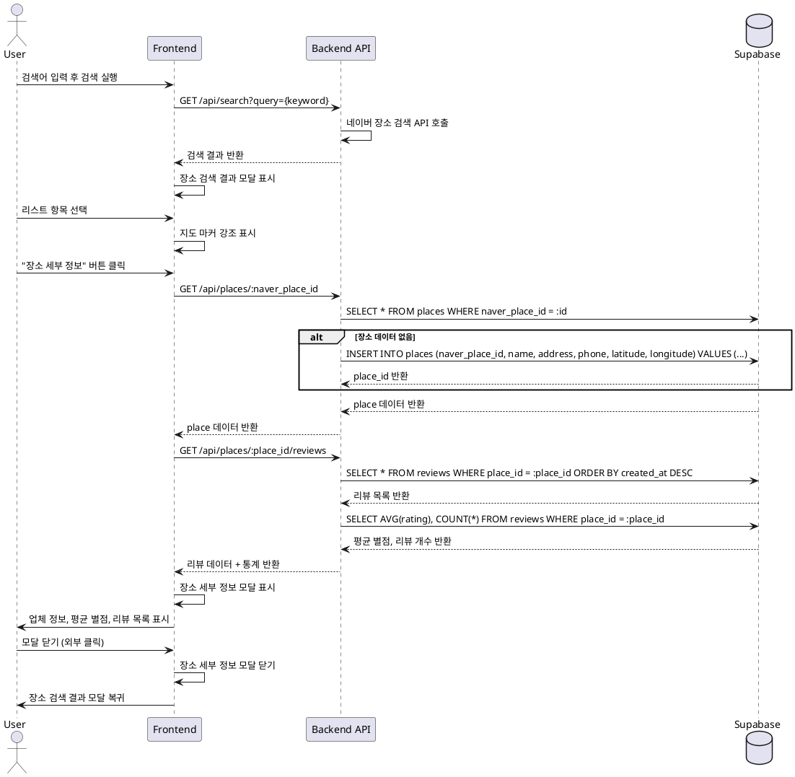

# UC-001: 장소 검색 및 정보 확인

## Primary Actor
일반 사용자 (음식점을 찾고 리뷰를 참고하는 사용자)

## Precondition
- 사용자가 메인 페이지에 접속하여 지도가 정상적으로 로드됨
- 네이버 지도 SDK가 초기화되어 강남역 중심으로 표시됨
- 상단 검색 바가 활성화되어 입력 가능한 상태

## Trigger
사용자가 상단 검색 바에 음식점명 또는 지역명을 입력하고 검색 버튼 클릭 또는 엔터 키 입력

## Main Scenario

### 1. 검색 실행
1. 사용자가 검색 바에 키워드 입력 (예: "강남 맛집")
2. 검색 버튼 클릭 또는 엔터 키 입력
3. 시스템이 네이버 장소 검색 API 호출
4. 장소 검색 결과 모달창 표시

### 2. 검색 결과 확인
1. 시스템이 검색 결과를 스크롤 가능한 리스트 형태로 표시
2. 각 리스트 항목에 업체명, 주소 등 기본 정보 표시
3. 사용자가 리스트를 스크롤하며 원하는 업체 탐색

### 3. 검색 결과 항목 선택
1. 사용자가 리스트에서 특정 업체 항목 클릭
2. 시스템이 해당 장소의 좌표(latitude, longitude) 확인
3. 지도상에서 해당 장소의 마커를 강조 표시
4. 모달창은 계속 표시 상태 유지

### 4. 장소 세부 정보 진입
1. 사용자가 선택한 항목 하단의 "장소 세부 정보" 버튼 클릭
2. 시스템이 다음 작업 수행:
   - places 테이블에서 naver_place_id 조회
   - 데이터가 없으면 places 테이블에 INSERT 후 place_id 획득
   - reviews 테이블에서 place_id로 리뷰 목록 조회
   - 평균 별점(AVG(rating)) 및 리뷰 개수(COUNT(*)) 계산
3. 장소 세부 정보 모달창 표시

### 5. 장소 세부 정보 확인
1. 시스템이 장소 세부 정보 모달에 다음 정보 표시:
   - 업체명, 주소, 전화번호
   - 평균 별점 (★ 5개 중 노란색 표시)
   - 총 리뷰 개수
   - 리뷰 목록 (작성자, 별점, 게시일자, 내용)
2. 사용자가 리뷰 정보 확인

### 6. 모달 닫기 및 복귀
1. 사용자가 모달 외부 클릭 또는 닫기 버튼 클릭
2. 시스템이 장소 세부 정보 모달 닫기
3. 직전 상태인 장소 검색 결과 모달로 복귀
4. (선택) 사용자가 검색 결과 모달도 닫으면 메인 지도 화면으로 복귀

## Edge Cases

### EC-001: 검색 결과 없음
- **상황**: 입력한 키워드로 검색 결과가 0건
- **처리**: 장소 검색 결과 모달에 "검색 결과가 없습니다" 안내 문구 표시

### EC-002: 네이버 API 호출 실패
- **상황**: 네트워크 오류 또는 API 장애로 검색 실패
- **처리**: 에러 메시지 표시 ("검색에 실패했습니다. 다시 시도해주세요")

### EC-003: 리뷰 데이터 없음
- **상황**: 장소는 존재하지만 작성된 리뷰가 0건
- **처리**:
  - 평균 별점: 0 또는 "-" 표시
  - 총 리뷰 개수: 0 표시
  - 리뷰 목록: "아직 작성된 리뷰가 없습니다" 안내 문구 표시

### EC-004: 데이터베이스 조회 실패
- **상황**: Supabase 연결 오류 또는 쿼리 실패
- **처리**: 에러 메시지 표시 ("정보를 불러오는 중 오류가 발생했습니다")

### EC-005: 빈 검색어 입력
- **상황**: 사용자가 검색어를 입력하지 않고 검색 시도
- **처리**: 검색 실행 차단 또는 "검색어를 입력해주세요" 안내 표시

## Business Rules

### BR-001: 장소 데이터 캐싱
- places 테이블에 naver_place_id가 존재하면 기존 데이터 사용
- 존재하지 않으면 네이버 API 데이터 기반으로 INSERT
- 중복 저장 방지를 위해 naver_place_id는 UNIQUE 제약조건 적용

### BR-002: 평균 별점 계산
- 리뷰가 1건 이상일 때: AVG(rating) 소수점 첫째 자리까지 표시
- 리뷰가 0건일 때: 0 또는 "-" 표시

### BR-003: 리뷰 정렬
- 리뷰 목록은 작성일시(created_at) 기준 내림차순 정렬
- 최신 리뷰가 상단에 표시됨

### BR-004: 모달 네비게이션
- 장소 세부 정보 모달 닫기 시 직전 상태(검색 결과 모달)로 복귀
- 검색 결과 모달 닫기 시 메인 지도 화면으로 복귀
- 모달 외부 클릭 시 해당 모달만 닫힘

### BR-005: 마커 강조
- 검색 결과에서 항목 선택 시 지도상의 해당 마커 강조 표시
- 강조 표시는 시각적으로 구분 가능한 스타일 적용 (예: 색상 변경, 크기 확대)

## Sequence Diagram

