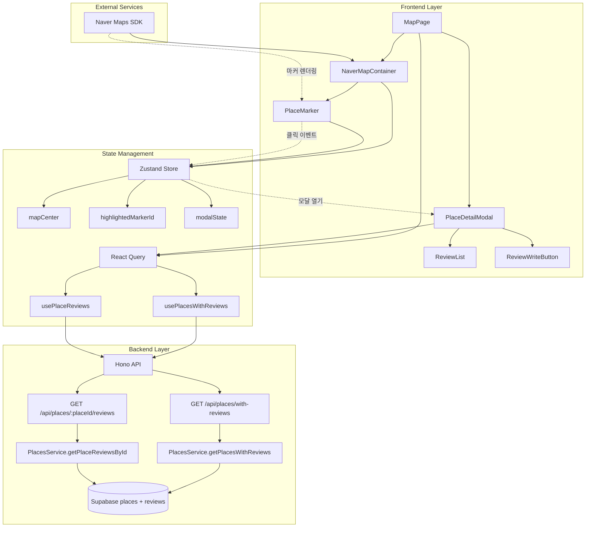
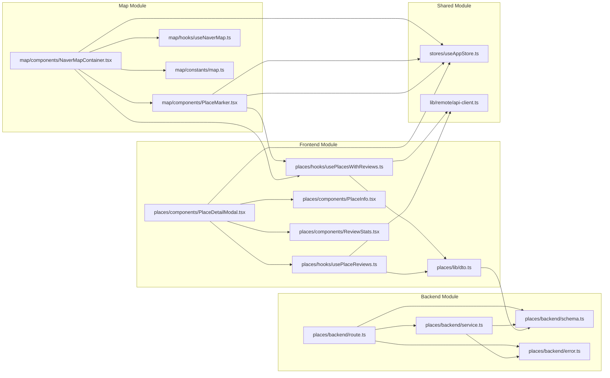

# UC-002: 지도 마커를 통한 정보 확인 - Implementation Plan

## 1. Feature Overview

### 1.1 기능 개요
UC-002는 사용자가 지도에서 리뷰가 존재하는 음식점을 마커로 확인하고, 마커 클릭 시 상세 정보를 조회하는 기능입니다.

**핵심 플로우:**
1. 메인 페이지 진입 시 네이버 지도 초기화 (강남역 중심)
2. 리뷰가 존재하는 장소 목록 조회 및 지도에 커스텀 마커 표시
3. 사용자가 마커 클릭 시 장소 상세 정보 모달 표시
4. 장소 정보, 평균 별점, 리뷰 목록 렌더링

### 1.2 비즈니스 규칙
- 마커는 리뷰가 1개 이상 존재하는 장소에만 표시
- 마커 클릭 시마다 최신 데이터를 API로 조회 (캐싱 미적용)
- 평균 별점은 소수점 첫째 자리까지 표시
- 리뷰는 최신순 정렬 (`created_at DESC`)

---

## 2. Technical Architecture

### 2.1 아키텍처 다이어그램



### 2.2 컴포넌트 계층 구조

```
src/
├── app/
│   └── page.tsx                              # 메인 페이지 (지도 + 모달)
├── features/
│   ├── map/
│   │   ├── components/
│   │   │   ├── NaverMapContainer.tsx         # 네이버 지도 래퍼
│   │   │   ├── PlaceMarker.tsx               # 커스텀 마커 컴포넌트
│   │   │   └── MapControls.tsx               # 지도 컨트롤 UI
│   │   ├── hooks/
│   │   │   ├── useNaverMap.ts                # 지도 초기화 훅
│   │   │   └── useMapMarkers.ts              # 마커 관리 훅
│   │   └── constants/
│   │       └── map.ts                        # 지도 기본 설정
│   ├── places/
│   │   ├── components/
│   │   │   ├── PlaceDetailModal.tsx          # 장소 상세 모달
│   │   │   ├── PlaceInfo.tsx                 # 장소 기본 정보
│   │   │   └── ReviewStats.tsx               # 평균 별점 + 리뷰 개수
│   │   ├── hooks/
│   │   │   ├── usePlacesWithReviews.ts       # 리뷰 있는 장소 목록 조회
│   │   │   └── usePlaceReviews.ts            # 특정 장소 리뷰 조회
│   │   ├── backend/
│   │   │   ├── route.ts                      # Hono 라우터
│   │   │   ├── service.ts                    # Supabase 쿼리
│   │   │   ├── schema.ts                     # Zod 스키마
│   │   │   └── error.ts                      # 에러 코드 정의
│   │   └── lib/
│   │       └── dto.ts                        # 클라이언트 타입 재노출
│   └── reviews/
│       └── components/
│           ├── ReviewList.tsx                # 리뷰 목록
│           └── ReviewItem.tsx                # 개별 리뷰
└── stores/
    └── useAppStore.ts                        # Zustand 전역 상태
```

### 2.3 상태 관리 아키텍처

#### Zustand Store (전역 UI 상태)
```typescript
interface AppState {
  // Modal 관리
  modalState: 'closed' | 'search-results' | 'place-detail' | 'review-write'
  modalHistory: ModalHistoryItem[]
  openModal: (type: ModalState, data?: any) => void
  closeModal: () => void
  goBackModal: () => void

  // Map 관리
  highlightedMarkerId: string | null
  mapCenter: { lat: number; lng: number }
  setHighlightedMarker: (id: string | null) => void
  setMapCenter: (lat: number, lng: number) => void

  // UI 상태
  status: 'idle' | 'loading' | 'success' | 'error'
  error: string | null
}
```

#### React Query (서버 상태)
```typescript
// 리뷰가 있는 장소 목록 (지도 마커용)
usePlacesWithReviews() → Place[]

// 특정 장소의 리뷰 및 통계
usePlaceReviews(placeId) → {
  place: Place
  reviews: Review[]
  avgRating: number
  reviewCount: number
}
```

---

## 3. Implementation Plan

### 3.1 Backend API Implementation

#### 3.1.1 GET /api/places/with-reviews

**파일:** `src/features/places/backend/route.ts`

```typescript
import type { Hono } from 'hono';
import { getSupabase, getLogger, type AppEnv } from '@/backend/hono/context';
import { respond } from '@/backend/http/response';
import { getPlacesWithReviews } from './service';

export const registerPlacesRoutes = (app: Hono<AppEnv>) => {
  // 리뷰가 존재하는 장소 목록 조회
  app.get('/places/with-reviews', async (c) => {
    const supabase = getSupabase(c);
    const logger = getLogger(c);

    const result = await getPlacesWithReviews(supabase);

    if (!result.ok) {
      logger.error('Failed to fetch places with reviews', result.error.message);
    }

    return respond(c, result);
  });

  // 특정 장소의 리뷰 조회
  app.get('/places/:placeId/reviews', async (c) => {
    const placeId = c.req.param('placeId');
    const supabase = getSupabase(c);
    const logger = getLogger(c);

    const result = await getPlaceReviewsById(supabase, placeId);

    if (!result.ok) {
      logger.error(`Failed to fetch reviews for place ${placeId}`, result.error.message);
    }

    return respond(c, result);
  });
};
```

**파일:** `src/features/places/backend/service.ts`

```typescript
import type { SupabaseClient } from '@supabase/supabase-js';
import { failure, success, type HandlerResult } from '@/backend/http/response';
import { PlacesWithReviewsResponseSchema, PlaceReviewsResponseSchema } from './schema';
import { placesErrorCodes, type PlacesServiceError } from './error';

export const getPlacesWithReviews = async (
  client: SupabaseClient,
): Promise<HandlerResult<PlacesWithReviewsResponse, PlacesServiceError, unknown>> => {
  const { data, error } = await client
    .from('places')
    .select('id, naver_place_id, name, latitude, longitude')
    .in('id',
      client.from('reviews').select('place_id')
    );

  if (error) {
    return failure(500, placesErrorCodes.fetchError, error.message);
  }

  const parsed = PlacesWithReviewsResponseSchema.safeParse(data);

  if (!parsed.success) {
    return failure(
      500,
      placesErrorCodes.validationError,
      'Places data validation failed',
      parsed.error.format()
    );
  }

  return success(parsed.data);
};

export const getPlaceReviewsById = async (
  client: SupabaseClient,
  placeId: string,
): Promise<HandlerResult<PlaceReviewsResponse, PlacesServiceError, unknown>> => {
  // 장소 정보 조회
  const { data: place, error: placeError } = await client
    .from('places')
    .select('id, naver_place_id, name, address, phone, latitude, longitude')
    .eq('id', placeId)
    .single();

  if (placeError) {
    return failure(500, placesErrorCodes.fetchError, placeError.message);
  }

  if (!place) {
    return failure(404, placesErrorCodes.notFound, 'Place not found');
  }

  // 리뷰 목록 조회
  const { data: reviews, error: reviewsError } = await client
    .from('reviews')
    .select('id, author_name, rating, content, created_at')
    .eq('place_id', placeId)
    .order('created_at', { ascending: false });

  if (reviewsError) {
    return failure(500, placesErrorCodes.fetchError, reviewsError.message);
  }

  // 평균 별점 및 리뷰 개수 계산
  const { data: stats, error: statsError } = await client
    .from('reviews')
    .select('rating')
    .eq('place_id', placeId);

  if (statsError) {
    return failure(500, placesErrorCodes.fetchError, statsError.message);
  }

  const avgRating = stats.length > 0
    ? stats.reduce((sum, r) => sum + r.rating, 0) / stats.length
    : 0;
  const reviewCount = stats.length;

  const responseData = {
    place,
    reviews: reviews || [],
    avgRating: Math.round(avgRating * 10) / 10, // 소수점 첫째자리
    reviewCount,
  };

  const parsed = PlaceReviewsResponseSchema.safeParse(responseData);

  if (!parsed.success) {
    return failure(
      500,
      placesErrorCodes.validationError,
      'Place reviews data validation failed',
      parsed.error.format()
    );
  }

  return success(parsed.data);
};
```

**파일:** `src/features/places/backend/schema.ts`

```typescript
import { z } from 'zod';

export const PlaceSchema = z.object({
  id: z.string().uuid(),
  naver_place_id: z.string(),
  name: z.string(),
  address: z.string(),
  phone: z.string().nullable(),
  latitude: z.number(),
  longitude: z.number(),
});

export const PlaceMarkerSchema = z.object({
  id: z.string().uuid(),
  naver_place_id: z.string(),
  name: z.string(),
  latitude: z.number(),
  longitude: z.number(),
});

export const ReviewSchema = z.object({
  id: z.string().uuid(),
  author_name: z.string(),
  rating: z.number().int().min(1).max(5),
  content: z.string(),
  created_at: z.string(),
});

export const PlacesWithReviewsResponseSchema = z.array(PlaceMarkerSchema);

export const PlaceReviewsResponseSchema = z.object({
  place: PlaceSchema,
  reviews: z.array(ReviewSchema),
  avgRating: z.number(),
  reviewCount: z.number().int(),
});

export type Place = z.infer<typeof PlaceSchema>;
export type PlaceMarker = z.infer<typeof PlaceMarkerSchema>;
export type Review = z.infer<typeof ReviewSchema>;
export type PlacesWithReviewsResponse = z.infer<typeof PlacesWithReviewsResponseSchema>;
export type PlaceReviewsResponse = z.infer<typeof PlaceReviewsResponseSchema>;
```

**파일:** `src/features/places/backend/error.ts`

```typescript
export const placesErrorCodes = {
  fetchError: 'PLACES_FETCH_ERROR',
  notFound: 'PLACE_NOT_FOUND',
  validationError: 'PLACES_VALIDATION_ERROR',
} as const;

export type PlacesServiceError = typeof placesErrorCodes[keyof typeof placesErrorCodes];
```

**파일:** `src/features/places/lib/dto.ts`

```typescript
export {
  PlaceSchema,
  PlaceMarkerSchema,
  ReviewSchema,
  PlacesWithReviewsResponseSchema,
  PlaceReviewsResponseSchema,
  type Place,
  type PlaceMarker,
  type Review,
  type PlacesWithReviewsResponse,
  type PlaceReviewsResponse,
} from '@/features/places/backend/schema';
```

#### 3.1.2 Hono 앱에 라우터 등록

**파일:** `src/backend/hono/app.ts`

```typescript
// 기존 코드에 추가
import { registerPlacesRoutes } from '@/features/places/backend/route';

export const createHonoApp = () => {
  // ... 기존 미들웨어 설정 ...

  registerPlacesRoutes(app);
  // registerExampleRoutes(app); // 기존 예시 라우터

  return app;
};
```

### 3.2 Frontend Implementation

#### 3.2.1 React Query Hooks

**파일:** `src/features/places/hooks/usePlacesWithReviews.ts`

```typescript
'use client';

import { useQuery } from '@tanstack/react-query';
import { apiClient, extractApiErrorMessage } from '@/lib/remote/api-client';
import { PlacesWithReviewsResponseSchema } from '@/features/places/lib/dto';

const fetchPlacesWithReviews = async () => {
  try {
    const { data } = await apiClient.get('/api/places/with-reviews');
    return PlacesWithReviewsResponseSchema.parse(data);
  } catch (error) {
    const message = extractApiErrorMessage(error, 'Failed to fetch places with reviews.');
    throw new Error(message);
  }
};

export const usePlacesWithReviews = () =>
  useQuery({
    queryKey: ['places', 'with-reviews'],
    queryFn: fetchPlacesWithReviews,
    staleTime: 5 * 60 * 1000, // 5분
    gcTime: 10 * 60 * 1000,   // 10분
  });
```

**파일:** `src/features/places/hooks/usePlaceReviews.ts`

```typescript
'use client';

import { useQuery } from '@tanstack/react-query';
import { apiClient, extractApiErrorMessage } from '@/lib/remote/api-client';
import { PlaceReviewsResponseSchema } from '@/features/places/lib/dto';

const fetchPlaceReviews = async (placeId: string) => {
  try {
    const { data } = await apiClient.get(`/api/places/${placeId}/reviews`);
    return PlaceReviewsResponseSchema.parse(data);
  } catch (error) {
    const message = extractApiErrorMessage(error, 'Failed to fetch place reviews.');
    throw new Error(message);
  }
};

export const usePlaceReviews = (placeId: string) =>
  useQuery({
    queryKey: ['places', placeId, 'reviews'],
    queryFn: () => fetchPlaceReviews(placeId),
    enabled: Boolean(placeId),
    staleTime: 30 * 1000,     // 30초
    gcTime: 2 * 60 * 1000,    // 2분
  });
```

#### 3.2.2 Zustand Store

**파일:** `src/stores/useAppStore.ts`

```typescript
'use client';

import { create } from 'zustand';

type ModalState = 'closed' | 'search-results' | 'place-detail' | 'review-write';

interface ModalHistoryItem {
  type: Exclude<ModalState, 'closed'>;
  data?: {
    placeId?: string;
    naverPlaceId?: string;
    searchQuery?: string;
  };
}

interface AppState {
  // Modal 관리
  modalState: ModalState;
  modalHistory: ModalHistoryItem[];
  openModal: (type: Exclude<ModalState, 'closed'>, data?: any) => void;
  closeModal: () => void;
  goBackModal: () => void;

  // Map 관리
  highlightedMarkerId: string | null;
  mapCenter: { lat: number; lng: number };
  setHighlightedMarker: (id: string | null) => void;
  setMapCenter: (lat: number, lng: number) => void;

  // UI 상태
  status: 'idle' | 'loading' | 'success' | 'error';
  error: string | null;
  setStatus: (status: 'idle' | 'loading' | 'success' | 'error') => void;
  setError: (error: string | null) => void;
}

export const useAppStore = create<AppState>((set, get) => ({
  modalState: 'closed',
  modalHistory: [],
  highlightedMarkerId: null,
  mapCenter: { lat: 37.498095, lng: 127.027610 }, // 강남역
  status: 'idle',
  error: null,

  openModal: (type, data) =>
    set((state) => ({
      modalState: type,
      modalHistory: [...state.modalHistory, { type, data }],
    })),

  closeModal: () =>
    set({
      modalState: 'closed',
      modalHistory: [],
    }),

  goBackModal: () =>
    set((state) => {
      const newHistory = [...state.modalHistory];
      newHistory.pop();
      const prevModal = newHistory[newHistory.length - 1];

      return {
        modalState: prevModal?.type || 'closed',
        modalHistory: newHistory,
      };
    }),

  setHighlightedMarker: (id) => set({ highlightedMarkerId: id }),
  setMapCenter: (lat, lng) => set({ mapCenter: { lat, lng } }),
  setStatus: (status) => set({ status }),
  setError: (error) => set({ error }),
}));
```

#### 3.2.3 Map Components

**파일:** `src/features/map/constants/map.ts`

```typescript
export const DEFAULT_MAP_CENTER = {
  lat: 37.498095,
  lng: 127.027610,
} as const; // 강남역

export const DEFAULT_MAP_ZOOM = 15;

export const MARKER_ICON = {
  default: {
    content: '<div class="custom-marker">📍</div>',
    size: new naver.maps.Size(32, 32),
    anchor: new naver.maps.Point(16, 32),
  },
  highlighted: {
    content: '<div class="custom-marker-highlighted">📍</div>',
    size: new naver.maps.Size(40, 40),
    anchor: new naver.maps.Point(20, 40),
  },
};
```

**파일:** `src/features/map/hooks/useNaverMap.ts`

```typescript
'use client';

import { useEffect, useRef } from 'react';
import { DEFAULT_MAP_CENTER, DEFAULT_MAP_ZOOM } from '@/features/map/constants/map';

interface UseNaverMapOptions {
  center?: { lat: number; lng: number };
  zoom?: number;
}

export const useNaverMap = (options: UseNaverMapOptions = {}) => {
  const mapRef = useRef<HTMLDivElement>(null);
  const naverMapRef = useRef<naver.maps.Map | null>(null);

  useEffect(() => {
    if (!mapRef.current || !window.naver) return;

    const mapOptions: naver.maps.MapOptions = {
      center: new naver.maps.LatLng(
        options.center?.lat || DEFAULT_MAP_CENTER.lat,
        options.center?.lng || DEFAULT_MAP_CENTER.lng
      ),
      zoom: options.zoom || DEFAULT_MAP_ZOOM,
      zoomControl: true,
      zoomControlOptions: {
        style: naver.maps.ZoomControlStyle.SMALL,
        position: naver.maps.Position.TOP_RIGHT,
      },
    };

    const map = new naver.maps.Map(mapRef.current, mapOptions);
    naverMapRef.current = map;

    return () => {
      naverMapRef.current?.destroy();
    };
  }, [options.center?.lat, options.center?.lng, options.zoom]);

  return { mapRef, naverMapRef };
};
```

**파일:** `src/features/map/components/NaverMapContainer.tsx`

```typescript
'use client';

import { useEffect } from 'react';
import { useNaverMap } from '@/features/map/hooks/useNaverMap';
import { usePlacesWithReviews } from '@/features/places/hooks/usePlacesWithReviews';
import { useAppStore } from '@/stores/useAppStore';
import { PlaceMarker } from './PlaceMarker';

interface NaverMapContainerProps {
  width?: string;
  height?: string;
}

export const NaverMapContainer = ({
  width = '100%',
  height = '100vh',
}: NaverMapContainerProps) => {
  const { mapRef, naverMapRef } = useNaverMap();
  const { data: places, isLoading, error } = usePlacesWithReviews();
  const mapCenter = useAppStore((state) => state.mapCenter);
  const setStatus = useAppStore((state) => state.setStatus);
  const setError = useAppStore((state) => state.setError);

  useEffect(() => {
    if (isLoading) {
      setStatus('loading');
    } else if (error) {
      setStatus('error');
      setError(error.message);
    } else if (places) {
      setStatus('success');
    }
  }, [isLoading, error, places, setStatus, setError]);

  useEffect(() => {
    if (naverMapRef.current && mapCenter) {
      const center = new naver.maps.LatLng(mapCenter.lat, mapCenter.lng);
      naverMapRef.current.setCenter(center);
    }
  }, [mapCenter]);

  return (
    <div className="relative" style={{ width, height }}>
      <div ref={mapRef} className="w-full h-full" />
      {naverMapRef.current && places && (
        <>
          {places.map((place) => (
            <PlaceMarker
              key={place.id}
              map={naverMapRef.current!}
              place={place}
            />
          ))}
        </>
      )}
    </div>
  );
};
```

**파일:** `src/features/map/components/PlaceMarker.tsx`

```typescript
'use client';

import { useEffect, useRef, memo } from 'react';
import { useAppStore } from '@/stores/useAppStore';
import type { PlaceMarker as PlaceMarkerType } from '@/features/places/lib/dto';

interface PlaceMarkerProps {
  map: naver.maps.Map;
  place: PlaceMarkerType;
}

export const PlaceMarker = memo(({ map, place }: PlaceMarkerProps) => {
  const markerRef = useRef<naver.maps.Marker | null>(null);
  const highlightedMarkerId = useAppStore((state) => state.highlightedMarkerId);
  const openModal = useAppStore((state) => state.openModal);
  const setHighlightedMarker = useAppStore((state) => state.setHighlightedMarker);

  const isHighlighted = highlightedMarkerId === place.id;

  useEffect(() => {
    if (!map) return;

    const marker = new naver.maps.Marker({
      position: new naver.maps.LatLng(place.latitude, place.longitude),
      map: map,
      title: place.name,
      icon: {
        content: isHighlighted
          ? '<div class="w-10 h-10 text-3xl">📍</div>'
          : '<div class="w-8 h-8 text-2xl">📍</div>',
      },
    });

    const clickListener = naver.maps.Event.addListener(marker, 'click', () => {
      setHighlightedMarker(place.id);
      openModal('place-detail', { placeId: place.id });
    });

    markerRef.current = marker;

    return () => {
      naver.maps.Event.removeListener(clickListener);
      marker.setMap(null);
    };
  }, [map, place, isHighlighted, openModal, setHighlightedMarker]);

  return null;
}, (prevProps, nextProps) => {
  return prevProps.place.id === nextProps.place.id;
});

PlaceMarker.displayName = 'PlaceMarker';
```

#### 3.2.4 Place Detail Components

**파일:** `src/features/places/components/PlaceDetailModal.tsx`

```typescript
'use client';

import { useAppStore } from '@/stores/useAppStore';
import { usePlaceReviews } from '@/features/places/hooks/usePlaceReviews';
import { Dialog, DialogContent, DialogHeader, DialogTitle } from '@/components/ui/dialog';
import { Button } from '@/components/ui/button';
import { Loader2 } from 'lucide-react';
import { PlaceInfo } from './PlaceInfo';
import { ReviewStats } from './ReviewStats';
import { ReviewList } from '@/features/reviews/components/ReviewList';

export const PlaceDetailModal = () => {
  const modalState = useAppStore((state) => state.modalState);
  const modalHistory = useAppStore((state) => state.modalHistory);
  const closeModal = useAppStore((state) => state.closeModal);
  const goBackModal = useAppStore((state) => state.goBackModal);
  const openModal = useAppStore((state) => state.openModal);

  const isOpen = modalState === 'place-detail';
  const currentModalData = modalHistory[modalHistory.length - 1];
  const placeId = currentModalData?.data?.placeId || '';

  const { data, isLoading, error } = usePlaceReviews(placeId);

  const handleClose = () => {
    const prevModal = modalHistory[modalHistory.length - 2];
    if (prevModal) {
      goBackModal();
    } else {
      closeModal();
    }
  };

  const handleReviewWrite = () => {
    openModal('review-write', { placeId });
  };

  return (
    <Dialog open={isOpen} onOpenChange={handleClose}>
      <DialogContent className="max-w-2xl max-h-[80vh] overflow-y-auto">
        <DialogHeader>
          <DialogTitle>장소 상세 정보</DialogTitle>
        </DialogHeader>

        {isLoading && (
          <div className="flex justify-center items-center py-8">
            <Loader2 className="h-8 w-8 animate-spin" />
          </div>
        )}

        {error && (
          <div className="text-red-500 text-center py-8">
            {error.message}
          </div>
        )}

        {data && (
          <div className="space-y-6">
            <PlaceInfo place={data.place} />
            <ReviewStats
              avgRating={data.avgRating}
              reviewCount={data.reviewCount}
            />
            <div className="flex justify-end">
              <Button onClick={handleReviewWrite}>
                리뷰 작성하기
              </Button>
            </div>
            <ReviewList reviews={data.reviews} />
          </div>
        )}
      </DialogContent>
    </Dialog>
  );
};
```

**파일:** `src/features/places/components/PlaceInfo.tsx`

```typescript
'use client';

import { Card, CardContent, CardHeader, CardTitle } from '@/components/ui/card';
import { MapPin, Phone } from 'lucide-react';
import type { Place } from '@/features/places/lib/dto';

interface PlaceInfoProps {
  place: Place;
}

export const PlaceInfo = ({ place }: PlaceInfoProps) => {
  return (
    <Card>
      <CardHeader>
        <CardTitle>{place.name}</CardTitle>
      </CardHeader>
      <CardContent className="space-y-2">
        <div className="flex items-start gap-2">
          <MapPin className="h-5 w-5 mt-0.5 text-muted-foreground" />
          <span className="text-sm">{place.address}</span>
        </div>
        {place.phone && (
          <div className="flex items-center gap-2">
            <Phone className="h-5 w-5 text-muted-foreground" />
            <span className="text-sm">{place.phone}</span>
          </div>
        )}
      </CardContent>
    </Card>
  );
};
```

**파일:** `src/features/places/components/ReviewStats.tsx`

```typescript
'use client';

import { Star } from 'lucide-react';
import { Card, CardContent } from '@/components/ui/card';

interface ReviewStatsProps {
  avgRating: number;
  reviewCount: number;
}

export const ReviewStats = ({ avgRating, reviewCount }: ReviewStatsProps) => {
  const fullStars = Math.floor(avgRating);
  const hasHalfStar = avgRating % 1 >= 0.5;

  return (
    <Card>
      <CardContent className="pt-6">
        <div className="flex items-center justify-between">
          <div className="flex items-center gap-2">
            <div className="flex">
              {[...Array(5)].map((_, i) => (
                <Star
                  key={i}
                  className={`h-6 w-6 ${
                    i < fullStars
                      ? 'fill-yellow-400 text-yellow-400'
                      : i === fullStars && hasHalfStar
                      ? 'fill-yellow-400/50 text-yellow-400'
                      : 'text-gray-300'
                  }`}
                />
              ))}
            </div>
            <span className="text-2xl font-bold">{avgRating.toFixed(1)}</span>
          </div>
          <div className="text-sm text-muted-foreground">
            총 {reviewCount}개의 리뷰
          </div>
        </div>
      </CardContent>
    </Card>
  );
};
```

#### 3.2.5 Review Components

**파일:** `src/features/reviews/components/ReviewList.tsx`

```typescript
'use client';

import { Card, CardHeader, CardTitle, CardContent } from '@/components/ui/card';
import { ReviewItem } from './ReviewItem';
import type { Review } from '@/features/places/lib/dto';

interface ReviewListProps {
  reviews: Review[];
}

export const ReviewList = ({ reviews }: ReviewListProps) => {
  if (reviews.length === 0) {
    return (
      <Card>
        <CardContent className="pt-6 text-center text-muted-foreground">
          아직 작성된 리뷰가 없습니다
        </CardContent>
      </Card>
    );
  }

  return (
    <Card>
      <CardHeader>
        <CardTitle>리뷰 목록</CardTitle>
      </CardHeader>
      <CardContent className="space-y-4">
        {reviews.map((review) => (
          <ReviewItem key={review.id} review={review} />
        ))}
      </CardContent>
    </Card>
  );
};
```

**파일:** `src/features/reviews/components/ReviewItem.tsx`

```typescript
'use client';

import { Star } from 'lucide-react';
import { format } from 'date-fns';
import { ko } from 'date-fns/locale';
import type { Review } from '@/features/places/lib/dto';

interface ReviewItemProps {
  review: Review;
}

export const ReviewItem = ({ review }: ReviewItemProps) => {
  return (
    <div className="border-b last:border-0 pb-4 last:pb-0">
      <div className="flex items-center justify-between mb-2">
        <div className="flex items-center gap-2">
          <span className="font-medium">{review.author_name}</span>
          <div className="flex">
            {[...Array(5)].map((_, i) => (
              <Star
                key={i}
                className={`h-4 w-4 ${
                  i < review.rating
                    ? 'fill-yellow-400 text-yellow-400'
                    : 'text-gray-300'
                }`}
              />
            ))}
          </div>
        </div>
        <span className="text-xs text-muted-foreground">
          {format(new Date(review.created_at), 'PPP', { locale: ko })}
        </span>
      </div>
      <p className="text-sm text-gray-700">{review.content}</p>
    </div>
  );
};
```

#### 3.2.6 Main Page

**파일:** `src/app/page.tsx`

```typescript
'use client';

import Script from 'next/script';
import { NaverMapContainer } from '@/features/map/components/NaverMapContainer';
import { PlaceDetailModal } from '@/features/places/components/PlaceDetailModal';

export default function HomePage() {
  return (
    <>
      <Script
        strategy="afterInteractive"
        src={`https://oapi.map.naver.com/openapi/v3/maps.js?ncpKeyId=${process.env.NEXT_PUBLIC_NCP_CLIENT_ID}&submodules=geocoder`}
      />
      <div className="relative w-full h-screen">
        <NaverMapContainer />
        <PlaceDetailModal />
      </div>
    </>
  );
}
```

---

## 4. API Specifications

### 4.1 GET /api/places/with-reviews

**목적:** 리뷰가 존재하는 모든 장소 조회 (지도 마커 표시용)

**요청:**
```http
GET /api/places/with-reviews
```

**응답 (성공):**
```json
HTTP/1.1 200 OK
Content-Type: application/json

[
  {
    "id": "uuid-1",
    "naver_place_id": "naver_12345678",
    "name": "맛집",
    "latitude": 37.498095,
    "longitude": 127.027610
  },
  {
    "id": "uuid-2",
    "naver_place_id": "naver_87654321",
    "name": "맛집2",
    "latitude": 37.500000,
    "longitude": 127.030000
  }
]
```

**응답 (실패):**
```json
HTTP/1.1 500 Internal Server Error
Content-Type: application/json

{
  "ok": false,
  "status": 500,
  "error": {
    "code": "PLACES_FETCH_ERROR",
    "message": "Database connection failed"
  }
}
```

### 4.2 GET /api/places/:placeId/reviews

**목적:** 특정 장소의 상세 정보 및 리뷰 목록 조회

**요청:**
```http
GET /api/places/uuid-1/reviews
```

**응답 (성공):**
```json
HTTP/1.1 200 OK
Content-Type: application/json

{
  "place": {
    "id": "uuid-1",
    "naver_place_id": "naver_12345678",
    "name": "맛집",
    "address": "서울시 강남구 역삼동",
    "phone": "02-1234-5678",
    "latitude": 37.498095,
    "longitude": 127.027610
  },
  "reviews": [
    {
      "id": "review-uuid-1",
      "author_name": "홍길동",
      "rating": 5,
      "content": "맛있어요!",
      "created_at": "2025-10-21T10:00:00Z"
    },
    {
      "id": "review-uuid-2",
      "author_name": "김철수",
      "rating": 4,
      "content": "좋아요",
      "created_at": "2025-10-20T15:30:00Z"
    }
  ],
  "avgRating": 4.5,
  "reviewCount": 2
}
```

**응답 (장소 없음):**
```json
HTTP/1.1 404 Not Found
Content-Type: application/json

{
  "ok": false,
  "status": 404,
  "error": {
    "code": "PLACE_NOT_FOUND",
    "message": "Place not found"
  }
}
```

---

## 5. State Management Details

### 5.1 Zustand Store States

```typescript
// 초기 상태
{
  modalState: 'closed',
  modalHistory: [],
  highlightedMarkerId: null,
  mapCenter: { lat: 37.498095, lng: 127.027610 },
  status: 'idle',
  error: null
}

// 마커 클릭 후 상태
{
  modalState: 'place-detail',
  modalHistory: [{ type: 'place-detail', data: { placeId: 'uuid-1' } }],
  highlightedMarkerId: 'uuid-1',
  mapCenter: { lat: 37.498095, lng: 127.027610 },
  status: 'success',
  error: null
}
```

### 5.2 React Query Cache Keys

```typescript
// 리뷰 있는 장소 목록
['places', 'with-reviews'] → PlaceMarker[]

// 특정 장소의 리뷰
['places', placeId, 'reviews'] → PlaceReviewsResponse
```

### 5.3 State Transition Flow

```
[페이지 로드]
  ↓
[usePlacesWithReviews 쿼리 실행]
  ↓
[지도에 마커 렌더링]
  ↓
[사용자가 마커 클릭]
  ↓
[Zustand: setHighlightedMarker(placeId)]
[Zustand: openModal('place-detail', { placeId })]
  ↓
[usePlaceReviews 쿼리 실행]
  ↓
[PlaceDetailModal 렌더링]
  ↓
[사용자가 모달 닫기]
  ↓
[Zustand: closeModal() or goBackModal()]
```

---

## 6. Error Handling

### 6.1 마커 표시 실패 (EC-004)

**발생 조건:** `GET /api/places/with-reviews` API 호출 실패 또는 빈 응답

**처리 방법:**
- 지도는 정상적으로 표시 (강남역 중심)
- 마커 없이 빈 지도 표시
- 검색 기능은 정상 작동 (UC-001 플로우 가능)
- 사용자에게 별도의 에러 메시지 표시하지 않음

**구현:**
```typescript
// NaverMapContainer.tsx
useEffect(() => {
  if (error) {
    setStatus('error');
    setError(error.message);
    // 마커는 렌더링하지 않지만 지도는 유지
  }
}, [error]);
```

### 6.2 장소 정보 조회 실패 (EC-002)

**발생 조건:** 네트워크 오류, Supabase 연결 실패, 또는 `place_id`가 존재하지 않음

**처리 방법:**
- 에러 토스트 메시지 표시: "장소 정보를 불러올 수 없습니다. 잠시 후 다시 시도해주세요."
- 모달을 열지 않고 메인 지도 화면 유지
- 콘솔에 에러 로그 기록

**구현:**
```typescript
// PlaceDetailModal.tsx
{error && (
  <div className="text-red-500 text-center py-8">
    장소 정보를 불러올 수 없습니다. 잠시 후 다시 시도해주세요.
  </div>
)}
```

### 6.3 리뷰가 없는 상태 (EC-001)

**발생 조건:** 마커 표시 조건상 발생하지 않지만, 데이터 동기화 이슈로 발생 가능

**처리 방법:**
- 장소 기본 정보는 표시
- 리뷰 영역에 "아직 작성된 리뷰가 없습니다" 메시지 표시
- "리뷰 작성하기" 버튼은 정상적으로 표시

**구현:**
```typescript
// ReviewList.tsx
if (reviews.length === 0) {
  return (
    <Card>
      <CardContent className="pt-6 text-center text-muted-foreground">
        아직 작성된 리뷰가 없습니다
      </CardContent>
    </Card>
  );
}
```

---

## 7. Performance Optimization

### 7.1 마커 메모이제이션

```typescript
// PlaceMarker.tsx
export const PlaceMarker = memo(({ map, place }: PlaceMarkerProps) => {
  // ...
}, (prevProps, nextProps) => {
  return prevProps.place.id === nextProps.place.id;
});
```

### 7.2 React Query 캐싱 전략

```typescript
// usePlacesWithReviews.ts
staleTime: 5 * 60 * 1000, // 5분 - 지도 마커는 자주 변경되지 않음
gcTime: 10 * 60 * 1000,   // 10분

// usePlaceReviews.ts
staleTime: 30 * 1000,     // 30초 - 리뷰는 비교적 자주 확인
gcTime: 2 * 60 * 1000,    // 2분
```

### 7.3 Zustand Selector 최적화

```typescript
// ❌ 나쁜 예: 전체 상태 구독
const state = useAppStore();

// ✅ 좋은 예: 필요한 부분만 선택
const highlightedMarkerId = useAppStore((state) => state.highlightedMarkerId);
const openModal = useAppStore((state) => state.openModal);
```

---

## 8. Testing Strategy

### 8.1 Backend Unit Tests

**파일:** `src/features/places/backend/__tests__/service.test.ts`

```typescript
describe('PlacesService', () => {
  describe('getPlacesWithReviews', () => {
    it('리뷰가 있는 장소 목록을 반환해야 함', async () => {
      // Given: Supabase 클라이언트 모킹
      const mockClient = createMockSupabaseClient();

      // When: 서비스 호출
      const result = await getPlacesWithReviews(mockClient);

      // Then: 성공 응답
      expect(result.ok).toBe(true);
      expect(result.data).toHaveLength(2);
      expect(result.data[0]).toHaveProperty('id');
      expect(result.data[0]).toHaveProperty('latitude');
    });

    it('데이터베이스 오류 시 실패 응답을 반환해야 함', async () => {
      // Given: 에러를 반환하는 모킹
      const mockClient = createMockSupabaseClient({ error: new Error('DB error') });

      // When: 서비스 호출
      const result = await getPlacesWithReviews(mockClient);

      // Then: 실패 응답
      expect(result.ok).toBe(false);
      expect(result.error.code).toBe(placesErrorCodes.fetchError);
    });
  });

  describe('getPlaceReviewsById', () => {
    it('장소 정보와 리뷰 목록을 반환해야 함', async () => {
      // Given: 유효한 placeId
      const placeId = 'uuid-1';
      const mockClient = createMockSupabaseClient();

      // When: 서비스 호출
      const result = await getPlaceReviewsById(mockClient, placeId);

      // Then: 성공 응답
      expect(result.ok).toBe(true);
      expect(result.data.place).toHaveProperty('name');
      expect(result.data.reviews).toBeInstanceOf(Array);
      expect(result.data.avgRating).toBeGreaterThanOrEqual(0);
      expect(result.data.reviewCount).toBeGreaterThanOrEqual(0);
    });

    it('존재하지 않는 장소 조회 시 404 반환', async () => {
      // Given: 존재하지 않는 placeId
      const placeId = 'non-existent-uuid';
      const mockClient = createMockSupabaseClient({ data: null });

      // When: 서비스 호출
      const result = await getPlaceReviewsById(mockClient, placeId);

      // Then: 404 응답
      expect(result.ok).toBe(false);
      expect(result.status).toBe(404);
      expect(result.error.code).toBe(placesErrorCodes.notFound);
    });

    it('평균 별점이 소수점 첫째자리로 반올림되어야 함', async () => {
      // Given: 평균 별점이 4.67인 경우
      const mockClient = createMockSupabaseClient({
        reviewStats: [{ rating: 5 }, { rating: 4 }, { rating: 5 }]
      });

      // When: 서비스 호출
      const result = await getPlaceReviewsById(mockClient, 'uuid-1');

      // Then: 4.7로 반올림
      expect(result.data.avgRating).toBe(4.7);
    });
  });
});
```

### 8.2 Frontend Component Tests

**파일:** `src/features/places/components/__tests__/PlaceDetailModal.test.tsx`

```typescript
describe('PlaceDetailModal', () => {
  it('모달이 열렸을 때 장소 정보를 표시해야 함', async () => {
    // Given: 모달 상태가 'place-detail'
    const { result } = renderHook(() => useAppStore());
    act(() => {
      result.current.openModal('place-detail', { placeId: 'uuid-1' });
    });

    // When: 컴포넌트 렌더링
    render(<PlaceDetailModal />);

    // Then: 장소 정보 표시
    await waitFor(() => {
      expect(screen.getByText('맛집')).toBeInTheDocument();
      expect(screen.getByText('서울시 강남구 역삼동')).toBeInTheDocument();
    });
  });

  it('로딩 중일 때 스피너를 표시해야 함', () => {
    // Given: 로딩 상태
    const { result } = renderHook(() => useAppStore());
    act(() => {
      result.current.openModal('place-detail', { placeId: 'uuid-1' });
    });

    // When: 컴포넌트 렌더링
    render(<PlaceDetailModal />);

    // Then: 로딩 스피너 표시
    expect(screen.getByRole('status')).toBeInTheDocument();
  });

  it('리뷰 작성하기 버튼 클릭 시 리뷰 작성 모달이 열려야 함', async () => {
    // Given: 장소 상세 모달 열림
    const { result } = renderHook(() => useAppStore());
    act(() => {
      result.current.openModal('place-detail', { placeId: 'uuid-1' });
    });

    render(<PlaceDetailModal />);

    await waitFor(() => {
      expect(screen.getByText('리뷰 작성하기')).toBeInTheDocument();
    });

    // When: 리뷰 작성하기 버튼 클릭
    const reviewButton = screen.getByText('리뷰 작성하기');
    fireEvent.click(reviewButton);

    // Then: 모달 상태가 'review-write'로 변경
    expect(result.current.modalState).toBe('review-write');
  });
});
```

### 8.3 QA Test Sheet

| 테스트 항목 | 시나리오 | 예상 결과 | 실제 결과 | 통과 여부 |
|------------|---------|----------|----------|----------|
| 지도 초기화 | 메인 페이지 진입 | 강남역 중심으로 지도 표시 | | |
| 마커 표시 | 리뷰 있는 장소 마커 렌더링 | 2개 이상의 마커 표시 | | |
| 마커 클릭 | 마커 클릭 시 모달 열기 | 장소 상세 정보 모달 표시 | | |
| 장소 정보 표시 | 모달 내 장소 정보 확인 | 업체명, 주소, 전화번호 표시 | | |
| 평균 별점 표시 | 리뷰 평균 별점 확인 | ★★★★☆ 형태로 표시, 소수점 첫째자리 | | |
| 리뷰 목록 표시 | 리뷰 목록 스크롤 | 최신순 정렬, 작성자명/별점/날짜/내용 표시 | | |
| 리뷰 없는 경우 | 리뷰가 0개인 장소 모달 | "아직 작성된 리뷰가 없습니다" 메시지 | | |
| 모달 닫기 | 모달 외부 클릭 | 메인 지도 화면으로 복귀 | | |
| API 실패 처리 | 네트워크 오류 시뮬레이션 | 에러 메시지 표시, 지도는 유지 | | |
| 리뷰 작성 진입 | "리뷰 작성하기" 버튼 클릭 | UC-003 리뷰 작성 모달 표시 | | |

---

## 9. Deployment Checklist

### 9.1 환경 변수 설정
```bash
# .env.local
NEXT_PUBLIC_NAVER_CLIENT_ID=your_naver_client_id
```

### 9.2 데이터베이스 마이그레이션 확인
- `supabase/migrations/0002_create_places_and_reviews.sql` 적용 여부 확인

### 9.3 필요한 shadcn-ui 컴포넌트 설치
```bash
npx shadcn@latest add dialog
npx shadcn@latest add card
npx shadcn@latest add button
```

### 9.4 네이버 지도 SDK 타입 정의 설치
```bash
npm install --save-dev @types/navermaps
```

### 9.5 필요한 라이브러리 설치 확인
```bash
npm install date-fns zustand @tanstack/react-query
```

---

## 10. Future Improvements

### 10.1 성능 최적화
- 마커 클러스터링 (많은 마커 표시 시)
- Virtual Scrolling (리뷰 목록이 많을 경우)
- React Query Prefetching (마커 호버 시)

### 10.2 UX 개선
- 마커 클릭 시 부드러운 지도 이동 애니메이션
- 모달 열릴 때 fade-in/out 애니메이션
- 스켈레톤 UI (로딩 상태)

### 10.3 기능 확장
- 지도 범위 내 장소만 조회 (성능 개선)
- 마커 필터링 (별점 4점 이상만 보기 등)
- 리뷰 페이지네이션

---

## 11. Module Dependency Diagram



---

이 구현 계획은 UC-002 기능의 완전한 구현 가이드를 제공합니다. 모든 코드는 AGENTS.md의 코드베이스 구조를 준수하며, 상태 관리는 Zustand와 React Query를 활용한 설계를 따릅니다.
