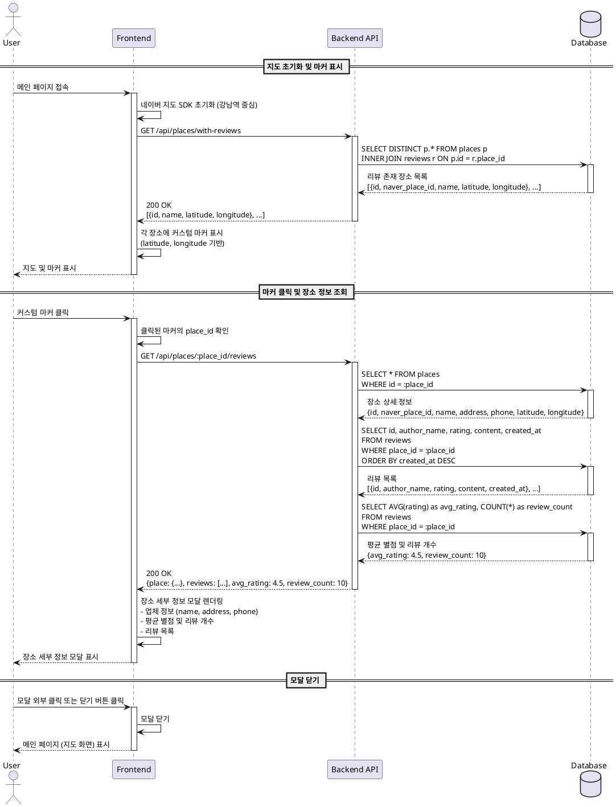

# UC-002: 지도 마커를 통한 정보 확인 플로우

## Use Case 정보

| 항목 | 내용 |
|------|------|
| **Use Case ID** | UC-002 |
| **Use Case Name** | 지도 마커를 통한 정보 확인 |
| **Primary Actor** | 일반 사용자 |
| **Stakeholders** | - 일반 사용자: 지도에서 직관적으로 음식점 정보를 확인하고자 함<br>- 리뷰 작성자: 작성한 리뷰가 있는 장소가 지도에 표시되기를 원함 |

---

## Precondition

- 사용자가 메인 페이지(지도 화면)에 접속한 상태
- 네이버 지도 SDK가 정상적으로 로드되어 지도가 표시됨
- 하나 이상의 리뷰 데이터가 존재하는 음식점이 Supabase에 저장되어 있음
- 리뷰가 존재하는 장소들의 커스텀 마커가 지도에 표시됨

---

## Trigger

사용자가 지도에 표시된 커스텀 마커를 클릭

---

## Main Scenario

| Step | Actor | Action | System Response |
|:----:|:-----:|:-------|:----------------|
| 1 | User | 메인 페이지 진입 | - 네이버 지도를 강남역 중심으로 초기화<br>- `GET /api/places/with-reviews` API 호출하여 리뷰가 존재하는 장소 목록 조회 |
| 2 | System | - | - 조회된 장소 목록을 지도상에 커스텀 마커로 표시<br>- 각 마커에 `place_id` 정보 연결 |
| 3 | User | 지도에서 원하는 커스텀 마커 클릭 | - 클릭된 마커의 `place_id` 확인<br>- `GET /api/places/:place_id/reviews` API 호출 |
| 4 | System | - | - Supabase `places` 테이블에서 장소 상세 정보 조회<br>- Supabase `reviews` 테이블에서 해당 장소의 리뷰 목록 조회<br>- 평균 별점 및 총 리뷰 개수 계산 (`AVG(rating)`, `COUNT(*)`) |
| 5 | System | - | - 장소 세부 정보 모달 표시<br>- 업체명, 주소, 전화번호 표시<br>- 평균 별점 (★★★★★, 5점 만점) 및 총 리뷰 개수 표시<br>- 리뷰 목록 렌더링 (작성자명, 별점, 게시일자, 내용) |
| 6 | User | 정보 확인 후 모달 외부 클릭 또는 닫기 버튼 클릭 | - 장소 세부 정보 모달 닫기<br>- 메인 페이지(지도 화면)로 복귀 |

---

## Edge Cases

### EC-001: 리뷰가 없는 상태에서 마커 클릭 (이론적 케이스)

**발생 조건:** Precondition에 따르면 리뷰가 존재하는 장소만 마커로 표시되므로 실제로는 발생하지 않음. 하지만 데이터 동기화 이슈로 인해 발생 가능.

**처리:**
- 백엔드 API가 빈 리뷰 목록과 평균 별점 0, 리뷰 개수 0 반환
- 모달에 "아직 작성된 리뷰가 없습니다" 메시지 표시
- "리뷰 작성하기" 버튼은 정상적으로 표시

### EC-002: 장소 정보 조회 API 실패

**발생 조건:** 네트워크 오류, Supabase 연결 실패, 또는 `place_id`가 존재하지 않음

**처리:**
- 에러 토스트 메시지 표시: "장소 정보를 불러올 수 없습니다. 잠시 후 다시 시도해주세요."
- 모달을 열지 않고 메인 지도 화면 유지
- 콘솔에 에러 로그 기록 (디버깅용)

### EC-003: 리뷰 데이터 조회 API 실패

**발생 조건:** Supabase 리뷰 테이블 조회 실패

**처리:**
- 장소 기본 정보는 표시
- 리뷰 영역에 "리뷰를 불러올 수 없습니다" 메시지 표시
- "리뷰 작성하기" 버튼은 정상 작동 (새 리뷰 작성은 가능)

### EC-004: 지도 초기 로드 시 마커 표시 실패

**발생 조건:** `GET /api/places/with-reviews` API 호출 실패 또는 빈 응답

**처리:**
- 지도는 정상적으로 표시 (강남역 중심)
- 마커 없이 빈 지도 표시
- 검색 기능은 정상 작동 (UC-001 플로우 가능)
- 사용자에게 별도의 에러 메시지 표시하지 않음 (리뷰가 없을 수도 있으므로)

### EC-005: 모달 표시 중 다른 마커 클릭

**발생 조건:** 장소 세부 정보 모달이 열린 상태에서 사용자가 지도의 다른 마커 클릭

**처리:**
- 기존 모달을 닫음
- 새로 클릭한 마커의 장소 정보로 모달을 다시 열기
- 또는 기존 모달 내용을 새 장소 정보로 업데이트 (UX 결정 필요)

---

## Business Rules

### BR-001: 마커 표시 조건

- 커스텀 마커는 **리뷰 데이터가 1개 이상 존재하는 장소**에만 표시
- 리뷰가 없는 장소는 검색을 통해서만 접근 가능

### BR-002: 평균 별점 계산

- 평균 별점은 해당 장소의 모든 리뷰 `rating` 값의 산술 평균
- 소수점 첫째 자리까지 표시 (예: 4.5점)
- 리뷰가 없을 경우 0점 또는 "평점 없음" 표시

### BR-003: 리뷰 정렬 순서

- 리뷰 목록은 최신순 정렬 (`created_at DESC`)
- 페이지네이션 미적용 (초기 스펙)

### BR-004: 모달 닫기 동작

- 모달 외부 클릭 시 모달 닫기
- 마커 진입 시 모달을 닫으면 메인 지도 화면으로 복귀
- 검색 결과에서 진입한 경우 UC-001과 동일하게 검색 결과 모달로 복귀

### BR-005: 실시간 데이터 반영

- 마커 클릭 시마다 최신 리뷰 데이터를 API를 통해 조회
- 클라이언트 캐싱 미적용 (초기 스펙)

---

## Sequence Diagram



---

## 관련 Use Cases

- **UC-001**: 장소 검색 및 정보 확인 플로우 (검색을 통한 진입)
- **UC-003**: 리뷰 작성 플로우 (장소 세부 정보 모달에서 "리뷰 작성하기" 버튼 클릭)

---

## 참고사항

### API 엔드포인트

1. **GET /api/places/with-reviews**
   - 목적: 리뷰가 존재하는 모든 장소 조회 (지도 마커 표시용)
   - 응답: `[{id, naver_place_id, name, latitude, longitude}, ...]`

2. **GET /api/places/:place_id/reviews**
   - 목적: 특정 장소의 상세 정보 및 리뷰 목록 조회
   - 응답: `{place: {...}, reviews: [...], avg_rating, review_count}`

### 데이터베이스 쿼리

```sql
-- 리뷰가 존재하는 장소 조회
SELECT DISTINCT p.*
FROM places p
INNER JOIN reviews r ON p.id = r.place_id;

-- 특정 장소의 리뷰 목록 조회
SELECT id, author_name, rating, content, created_at
FROM reviews
WHERE place_id = :place_id
ORDER BY created_at DESC;

-- 평균 별점 및 리뷰 개수 계산
SELECT
  AVG(rating) as avg_rating,
  COUNT(*) as review_count
FROM reviews
WHERE place_id = :place_id;
```

### UI/UX 고려사항

- 커스텀 마커 디자인은 기본 마커와 시각적으로 구분되어야 함 (색상, 아이콘 등)
- 마커 클릭 시 로딩 인디케이터 표시 (API 응답 대기 중)
- 평균 별점은 시각적으로 별 아이콘 (★★★★☆)으로 표시
- 리뷰가 많을 경우 스크롤 가능한 영역으로 처리
- 모달 애니메이션 (fade-in/out) 적용 권장
