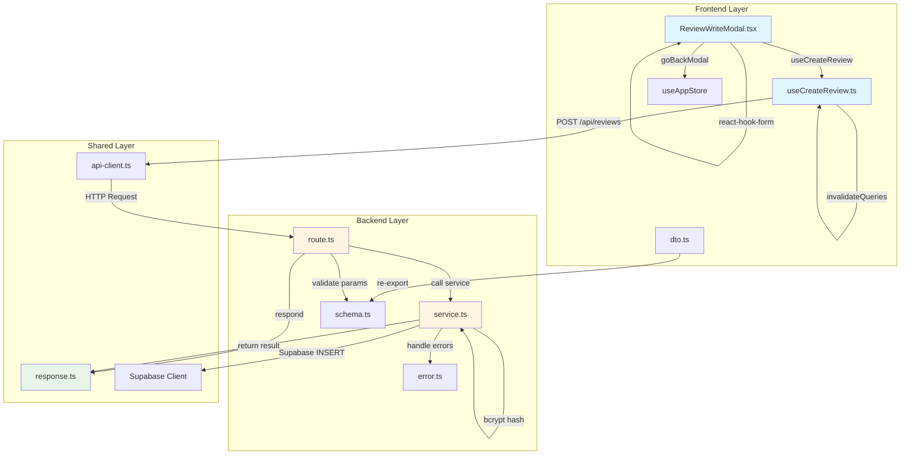
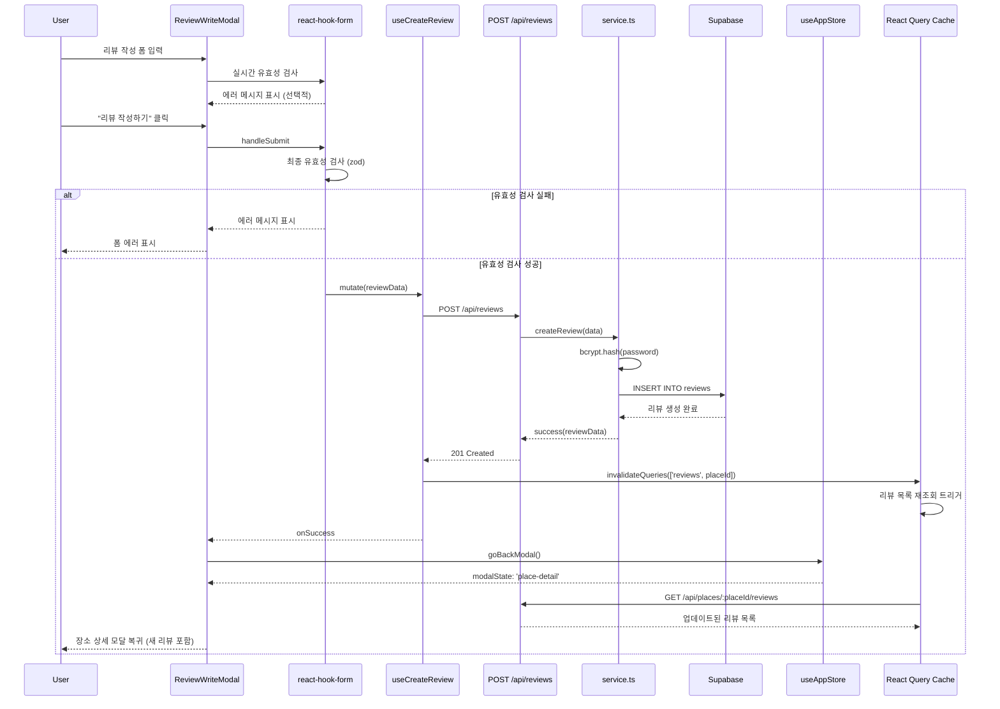

# UC-003: 리뷰 작성 플로우 - 구현 계획서 (Implementation Plan)

## 1. Feature Overview

### 1.1 기능 개요
리뷰 작성 플로우는 사용자가 장소 상세 정보 모달에서 "리뷰 작성하기" 버튼을 클릭하여 리뷰를 작성하고, 성공적으로 제출하면 장소 상세 모달로 복귀하여 업데이트된 리뷰 목록을 확인하는 기능입니다.

### 1.2 핵심 요구사항
- **폼 입력 및 유효성 검사**: react-hook-form + zod를 사용한 실시간 폼 검증
- **비밀번호 보안**: 4자리 숫자 비밀번호를 bcrypt로 해싱하여 저장
- **모달 네비게이션**: 리뷰 작성 완료 후 Zustand의 `goBackModal()`을 통해 장소 상세 모달로 복귀
- **데이터 동기화**: React Query의 `invalidateQueries`를 통한 자동 리뷰 목록 갱신

### 1.3 관련 유스케이스
- **Precondition**: 사용자가 장소 상세 정보 모달을 열어 특정 음식점 정보를 조회한 상태
- **Trigger**: "리뷰 작성하기" 버튼 클릭
- **Success**: 리뷰 저장 성공 → 장소 상세 모달로 복귀 → 리뷰 목록 자동 갱신

---

## 2. Technical Architecture

### 2.1 상태 관리 전략

#### 2.1.1 Form State (react-hook-form + zod)
```typescript
// 리뷰 작성 폼 상태
reviewForm: {
  author_name: string   // 작성자명 (필수, 1-100자)
  rating: number        // 별점 (필수, 1-5)
  content: string       // 리뷰 내용 (필수, 1-500자)
  password: string      // 비밀번호 (필수, 4자리 숫자)
}

// 실시간 유효성 검사 (zod resolver)
- author_name: 필수, 최대 100자
- rating: 1~5 범위
- content: 필수, 최대 500자
- password: 4자리 숫자 정규식
```

#### 2.1.2 Server State (React Query)
```typescript
// Mutation: 리뷰 생성
useCreateReview() → POST /api/reviews
  - onSuccess: invalidateQueries(['reviews', placeId])
  - onError: 폼 에러 메시지 표시

// Query: 리뷰 목록 (자동 재조회)
useReviews(placeId) → GET /api/places/:placeId/reviews
  - 리뷰 작성 성공 시 자동으로 재조회됨
```

#### 2.1.3 UI State (Zustand)
```typescript
// 모달 네비게이션
modalState: 'review-write' → goBackModal() → 'place-detail'
modalHistory: 모달 이력 관리 (복귀 로직용)
```

### 2.2 Backend Architecture (Hono + Supabase)

#### 2.2.1 API Layer
```
POST /api/reviews
  ├─ 요청 검증 (zod schema)
  ├─ 비즈니스 로직 (service.ts)
  │   ├─ place_id 존재 여부 확인
  │   ├─ 비밀번호 bcrypt 해싱
  │   └─ Supabase INSERT
  └─ 응답 반환 (success/failure)
```

#### 2.2.2 Security
- **비밀번호 해싱**: bcrypt (salt rounds: 10)
- **평문 비밀번호**: 절대 저장하지 않음, 클라이언트에서 서버로 전송 후 즉시 해싱
- **유효성 검사**: 클라이언트 + 서버 이중 검증

---

## 3. Module Design

### 3.1 모듈 개요

| 모듈 | 위치 | 역할 | 의존성 |
|------|------|------|--------|
| **Backend API** | `src/features/reviews/backend/route.ts` | 리뷰 작성 API 엔드포인트 | Hono, Zod, Supabase |
| **Service Layer** | `src/features/reviews/backend/service.ts` | 비즈니스 로직 (비밀번호 해싱, DB 저장) | Supabase, bcrypt |
| **Schema Layer** | `src/features/reviews/backend/schema.ts` | 요청/응답 zod 스키마 정의 | Zod |
| **Error Handler** | `src/features/reviews/backend/error.ts` | 에러 코드 정의 | - |
| **Frontend Component** | `src/features/reviews/components/ReviewWriteModal.tsx` | 리뷰 작성 모달 UI | react-hook-form, shadcn-ui |
| **React Query Hook** | `src/features/reviews/hooks/useCreateReview.ts` | 리뷰 생성 mutation | @tanstack/react-query |
| **DTO** | `src/features/reviews/lib/dto.ts` | 백엔드 스키마 재노출 | backend/schema |

### 3.2 공통 모듈 의존성
- `src/backend/http/response.ts`: success/failure/respond 헬퍼
- `src/lib/remote/api-client.ts`: axios 클라이언트
- `src/stores/useAppStore.ts`: Zustand 모달 상태 관리 (goBackModal)

---

## 4. Architecture Diagram

### 4.1 모듈 간 관계도 (Mermaid)



### 4.2 데이터 흐름 (Sequence Diagram)



---

## 5. Implementation Plan

### 5.1 Backend Implementation

#### 5.1.1 Schema Definition (`src/features/reviews/backend/schema.ts`)

**목적**: 요청/응답 데이터 구조를 zod로 정의하여 타입 안전성 확보

```typescript
import { z } from 'zod';

// POST /api/reviews 요청 스키마
export const CreateReviewRequestSchema = z.object({
  place_id: z.string().uuid({ message: 'place_id must be a valid UUID.' }),
  author_name: z.string()
    .min(1, '작성자명을 입력해주세요')
    .max(100, '작성자명은 100자를 초과할 수 없습니다'),
  rating: z.number()
    .int('별점은 정수여야 합니다')
    .min(1, '별점은 1~5 사이여야 합니다')
    .max(5, '별점은 1~5 사이여야 합니다'),
  content: z.string()
    .min(1, '리뷰 내용을 입력해주세요')
    .max(500, '리뷰 내용은 500자를 초과할 수 없습니다'),
  password: z.string()
    .regex(/^\d{4}$/, '비밀번호는 4자리 숫자여야 합니다'),
});

export type CreateReviewRequest = z.infer<typeof CreateReviewRequestSchema>;

// 응답 스키마
export const ReviewResponseSchema = z.object({
  id: z.string().uuid(),
  place_id: z.string().uuid(),
  author_name: z.string(),
  rating: z.number(),
  content: z.string(),
  created_at: z.string(),
});

export type ReviewResponse = z.infer<typeof ReviewResponseSchema>;

// Supabase 테이블 Row 스키마
export const ReviewTableRowSchema = z.object({
  id: z.string().uuid(),
  place_id: z.string().uuid(),
  author_name: z.string(),
  rating: z.number(),
  content: z.string(),
  password_hash: z.string(),
  created_at: z.string(),
  updated_at: z.string(),
});

export type ReviewRow = z.infer<typeof ReviewTableRowSchema>;
```

**검증 규칙**:
- ✅ 작성자명: 필수, 1-100자
- ✅ 별점: 필수, 1-5 정수
- ✅ 리뷰 내용: 필수, 1-500자
- ✅ 비밀번호: 필수, 4자리 숫자 정규식
- ✅ place_id: UUID 형식

#### 5.1.2 Service Layer (`src/features/reviews/backend/service.ts`)

**목적**: 비즈니스 로직 처리 (비밀번호 해싱, DB 저장)

```typescript
import type { SupabaseClient } from '@supabase/supabase-js';
import bcrypt from 'bcryptjs';
import {
  failure,
  success,
  type HandlerResult,
} from '@/backend/http/response';
import {
  ReviewResponseSchema,
  ReviewTableRowSchema,
  type CreateReviewRequest,
  type ReviewResponse,
} from './schema';
import {
  reviewErrorCodes,
  type ReviewServiceError,
} from './error';

const REVIEWS_TABLE = 'reviews';
const PLACES_TABLE = 'places';
const BCRYPT_SALT_ROUNDS = 10;

export const createReview = async (
  client: SupabaseClient,
  data: CreateReviewRequest,
): Promise<HandlerResult<ReviewResponse, ReviewServiceError, unknown>> => {
  // 1. place_id 존재 여부 확인
  const { data: place, error: placeError } = await client
    .from(PLACES_TABLE)
    .select('id')
    .eq('id', data.place_id)
    .maybeSingle();

  if (placeError) {
    return failure(500, reviewErrorCodes.fetchError, placeError.message);
  }

  if (!place) {
    return failure(404, reviewErrorCodes.placeNotFound, '존재하지 않는 장소입니다');
  }

  // 2. 비밀번호 해싱
  const passwordHash = await bcrypt.hash(data.password, BCRYPT_SALT_ROUNDS);

  // 3. 리뷰 저장
  const { data: reviewRow, error: insertError } = await client
    .from(REVIEWS_TABLE)
    .insert({
      place_id: data.place_id,
      author_name: data.author_name,
      rating: data.rating,
      content: data.content,
      password_hash: passwordHash,
    })
    .select('id, place_id, author_name, rating, content, created_at')
    .single();

  if (insertError) {
    return failure(500, reviewErrorCodes.createError, '리뷰 작성에 실패했습니다', insertError.message);
  }

  // 4. 응답 데이터 검증
  const parsed = ReviewResponseSchema.safeParse(reviewRow);

  if (!parsed.success) {
    return failure(
      500,
      reviewErrorCodes.validationError,
      '리뷰 데이터 검증에 실패했습니다',
      parsed.error.format(),
    );
  }

  return success(parsed.data, 201);
};
```

**핵심 로직**:
- ✅ place_id 존재 확인 (404 에러 처리)
- ✅ bcrypt.hash(password, 10) 사용
- ✅ Supabase INSERT 후 생성된 데이터 반환
- ✅ 응답 데이터 zod 검증

#### 5.1.3 Error Codes (`src/features/reviews/backend/error.ts`)

```typescript
export const reviewErrorCodes = {
  placeNotFound: 'PLACE_NOT_FOUND',
  createError: 'REVIEW_CREATE_ERROR',
  fetchError: 'REVIEW_FETCH_ERROR',
  validationError: 'REVIEW_VALIDATION_ERROR',
} as const;

type ReviewErrorValue = (typeof reviewErrorCodes)[keyof typeof reviewErrorCodes];

export type ReviewServiceError = ReviewErrorValue;
```

#### 5.1.4 Route Handler (`src/features/reviews/backend/route.ts`)

**목적**: Hono 라우터 정의 및 요청/응답 처리

```typescript
import type { Hono } from 'hono';
import {
  failure,
  respond,
  type ErrorResult,
} from '@/backend/http/response';
import {
  getLogger,
  getSupabase,
  type AppEnv,
} from '@/backend/hono/context';
import { CreateReviewRequestSchema } from './schema';
import { createReview } from './service';
import {
  reviewErrorCodes,
  type ReviewServiceError,
} from './error';

export const registerReviewRoutes = (app: Hono<AppEnv>) => {
  app.post('/reviews', async (c) => {
    const body = await c.req.json();
    const parsedBody = CreateReviewRequestSchema.safeParse(body);

    if (!parsedBody.success) {
      return respond(
        c,
        failure(
          400,
          'INVALID_REVIEW_REQUEST',
          '리뷰 요청 데이터가 올바르지 않습니다',
          parsedBody.error.format(),
        ),
      );
    }

    const supabase = getSupabase(c);
    const logger = getLogger(c);

    const result = await createReview(supabase, parsedBody.data);

    if (!result.ok) {
      const errorResult = result as ErrorResult<ReviewServiceError, unknown>;

      if (errorResult.error.code === reviewErrorCodes.createError) {
        logger.error('Failed to create review', errorResult.error.message);
      }

      return respond(c, result);
    }

    return respond(c, result);
  });
};
```

**처리 흐름**:
1. ✅ 요청 body 파싱
2. ✅ zod 스키마 검증 (400 에러)
3. ✅ service.createReview 호출
4. ✅ 에러 로깅 (필요 시)
5. ✅ success/failure 응답 반환

#### 5.1.5 Hono App 라우터 등록

**파일**: `src/backend/hono/app.ts`에 라우터 등록

```typescript
import { registerReviewRoutes } from '@/features/reviews/backend/route';

export const createHonoApp = () => {
  const app = new Hono<AppEnv>();

  // ... 기존 미들웨어 ...

  registerReviewRoutes(app);  // ← 추가

  return app;
};
```

---

### 5.2 Frontend Implementation

#### 5.2.1 DTO (`src/features/reviews/lib/dto.ts`)

**목적**: 백엔드 스키마를 프론트엔드에서 재사용

```typescript
export {
  CreateReviewRequestSchema,
  ReviewResponseSchema,
  type CreateReviewRequest,
  type ReviewResponse,
} from '@/features/reviews/backend/schema';
```

#### 5.2.2 React Query Hook (`src/features/reviews/hooks/useCreateReview.ts`)

**목적**: 리뷰 생성 mutation 훅

```typescript
'use client';

import { useMutation, useQueryClient } from '@tanstack/react-query';
import { apiClient, extractApiErrorMessage } from '@/lib/remote/api-client';
import {
  CreateReviewRequestSchema,
  type CreateReviewRequest,
  type ReviewResponse,
} from '@/features/reviews/lib/dto';

const postReview = async (data: CreateReviewRequest): Promise<ReviewResponse> => {
  try {
    const { data: responseData } = await apiClient.post('/api/reviews', data);
    return responseData;
  } catch (error) {
    const message = extractApiErrorMessage(error, '리뷰 작성에 실패했습니다');
    throw new Error(message);
  }
};

export const useCreateReview = () => {
  const queryClient = useQueryClient();

  return useMutation({
    mutationFn: postReview,
    onSuccess: (data, variables) => {
      // 리뷰 목록 무효화 → 자동 재조회
      queryClient.invalidateQueries({
        queryKey: ['reviews', variables.place_id],
      });
    },
  });
};
```

**핵심 로직**:
- ✅ POST /api/reviews 호출
- ✅ onSuccess: invalidateQueries로 리뷰 목록 갱신
- ✅ extractApiErrorMessage로 에러 처리

#### 5.2.3 Review Write Modal (`src/features/reviews/components/ReviewWriteModal.tsx`)

**목적**: 리뷰 작성 폼 UI 및 상태 관리

```typescript
'use client';

import { useForm } from 'react-hook-form';
import { zodResolver } from '@hookform/resolvers/zod';
import { z } from 'zod';
import { useCreateReview } from '@/features/reviews/hooks/useCreateReview';
import { useAppStore } from '@/stores/useAppStore';
import { Button } from '@/components/ui/button';
import { Input } from '@/components/ui/input';
import { Textarea } from '@/components/ui/textarea';
import {
  Dialog,
  DialogContent,
  DialogHeader,
  DialogTitle,
} from '@/components/ui/dialog';
import { Label } from '@/components/ui/label';
import { Alert, AlertDescription } from '@/components/ui/alert';

// 클라이언트 전용 폼 스키마 (password 평문)
const reviewFormSchema = z.object({
  author_name: z.string()
    .min(1, '작성자명을 입력해주세요')
    .max(100, '작성자명은 100자를 초과할 수 없습니다'),
  rating: z.number()
    .int()
    .min(1, '별점을 선택해주세요')
    .max(5, '별점은 1~5 사이여야 합니다'),
  content: z.string()
    .min(1, '리뷰 내용을 입력해주세요')
    .max(500, '리뷰 내용은 500자를 초과할 수 없습니다'),
  password: z.string()
    .regex(/^\d{4}$/, '비밀번호는 4자리 숫자여야 합니다'),
});

type ReviewFormData = z.infer<typeof reviewFormSchema>;

interface ReviewWriteModalProps {
  placeId: string;
  placeName: string;
  placeAddress: string;
}

export const ReviewWriteModal = ({
  placeId,
  placeName,
  placeAddress,
}: ReviewWriteModalProps) => {
  const { modalState, goBackModal } = useAppStore();
  const createReview = useCreateReview();

  const form = useForm<ReviewFormData>({
    resolver: zodResolver(reviewFormSchema),
    defaultValues: {
      author_name: '',
      rating: 0,
      content: '',
      password: '',
    },
  });

  const onSubmit = async (data: ReviewFormData) => {
    try {
      await createReview.mutateAsync({
        place_id: placeId,
        ...data,
      });
      goBackModal(); // 성공 시 장소 상세 모달로 복귀
    } catch (error) {
      form.setError('root', {
        message: error instanceof Error ? error.message : '리뷰 작성에 실패했습니다',
      });
    }
  };

  const isOpen = modalState === 'review-write';

  return (
    <Dialog open={isOpen} onOpenChange={() => goBackModal()}>
      <DialogContent className="max-w-md">
        <DialogHeader>
          <DialogTitle>리뷰 작성하기</DialogTitle>
        </DialogHeader>

        {/* 장소 정보 표시 */}
        <div className="mb-4 p-3 bg-gray-50 rounded">
          <p className="font-semibold">{placeName}</p>
          <p className="text-sm text-gray-600">{placeAddress}</p>
        </div>

        <form onSubmit={form.handleSubmit(onSubmit)} className="space-y-4">
          {/* 작성자명 */}
          <div>
            <Label htmlFor="author_name">작성자명 *</Label>
            <Input
              id="author_name"
              {...form.register('author_name')}
              placeholder="이름을 입력하세요"
            />
            {form.formState.errors.author_name && (
              <p className="text-sm text-red-600 mt-1">
                {form.formState.errors.author_name.message}
              </p>
            )}
          </div>

          {/* 별점 */}
          <div>
            <Label htmlFor="rating">별점 *</Label>
            <select
              id="rating"
              {...form.register('rating', { valueAsNumber: true })}
              className="w-full border rounded px-3 py-2"
            >
              <option value={0}>별점 선택</option>
              <option value={1}>⭐ 1점</option>
              <option value={2}>⭐⭐ 2점</option>
              <option value={3}>⭐⭐⭐ 3점</option>
              <option value={4}>⭐⭐⭐⭐ 4점</option>
              <option value={5}>⭐⭐⭐⭐⭐ 5점</option>
            </select>
            {form.formState.errors.rating && (
              <p className="text-sm text-red-600 mt-1">
                {form.formState.errors.rating.message}
              </p>
            )}
          </div>

          {/* 리뷰 내용 */}
          <div>
            <Label htmlFor="content">리뷰 내용 *</Label>
            <Textarea
              id="content"
              {...form.register('content')}
              placeholder="리뷰를 작성해주세요 (최대 500자)"
              rows={5}
            />
            <div className="flex justify-between items-center mt-1">
              {form.formState.errors.content && (
                <p className="text-sm text-red-600">
                  {form.formState.errors.content.message}
                </p>
              )}
              <p className="text-sm text-gray-500 ml-auto">
                {form.watch('content')?.length || 0} / 500자
              </p>
            </div>
          </div>

          {/* 비밀번호 */}
          <div>
            <Label htmlFor="password">비밀번호 (4자리 숫자) *</Label>
            <Input
              id="password"
              type="password"
              {...form.register('password')}
              placeholder="4자리 숫자"
              maxLength={4}
            />
            {form.formState.errors.password && (
              <p className="text-sm text-red-600 mt-1">
                {form.formState.errors.password.message}
              </p>
            )}
          </div>

          {/* 전역 에러 */}
          {form.formState.errors.root && (
            <Alert variant="destructive">
              <AlertDescription>{form.formState.errors.root.message}</AlertDescription>
            </Alert>
          )}

          {/* 제출 버튼 */}
          <div className="flex justify-end gap-2">
            <Button
              type="button"
              variant="outline"
              onClick={() => goBackModal()}
              disabled={createReview.isPending}
            >
              취소
            </Button>
            <Button
              type="submit"
              disabled={createReview.isPending}
            >
              {createReview.isPending ? '작성 중...' : '리뷰 작성하기'}
            </Button>
          </div>
        </form>
      </DialogContent>
    </Dialog>
  );
};
```

**핵심 기능**:
- ✅ react-hook-form + zodResolver 사용
- ✅ 실시간 유효성 검사 및 에러 메시지 표시
- ✅ 글자 수 카운터 (content)
- ✅ 제출 중 버튼 비활성화
- ✅ 성공 시 goBackModal() 호출
- ✅ 에러 시 root 에러 표시

---

### 5.3 Validation Rules

#### 5.3.1 클라이언트 측 검증 (react-hook-form + zod)

| 필드 | 규칙 | 에러 메시지 |
|------|------|-------------|
| `author_name` | 필수, 1-100자 | "작성자명을 입력해주세요" / "작성자명은 100자를 초과할 수 없습니다" |
| `rating` | 필수, 1-5 정수 | "별점을 선택해주세요" / "별점은 1~5 사이여야 합니다" |
| `content` | 필수, 1-500자 | "리뷰 내용을 입력해주세요" / "리뷰 내용은 500자를 초과할 수 없습니다" |
| `password` | 필수, 4자리 숫자 | "비밀번호는 4자리 숫자여야 합니다" |

#### 5.3.2 서버 측 검증 (zod + Supabase)

| 검증 항목 | 처리 | 응답 |
|---------|------|------|
| place_id 존재 여부 | Supabase SELECT 쿼리 | 404: "존재하지 않는 장소입니다" |
| 필드 형식 검증 | zod safeParse | 400: "리뷰 요청 데이터가 올바르지 않습니다" |
| rating 범위 | zod min/max | 400: "별점은 1~5 사이여야 합니다" |
| content 길이 | zod max | 400: "리뷰 내용은 500자를 초과할 수 없습니다" |

---

## 6. API Specifications

### 6.1 POST /api/reviews

#### Request
```http
POST /api/reviews
Content-Type: application/json

{
  "place_id": "uuid-1",
  "author_name": "홍길동",
  "rating": 5,
  "content": "맛있어요!",
  "password": "1234"
}
```

#### Response (Success)
```http
HTTP/1.1 201 Created
Content-Type: application/json

{
  "id": "review-uuid",
  "place_id": "uuid-1",
  "author_name": "홍길동",
  "rating": 5,
  "content": "맛있어요!",
  "created_at": "2025-10-22T10:00:00Z"
}
```

#### Response (Error - 400 Bad Request)
```http
HTTP/1.1 400 Bad Request
Content-Type: application/json

{
  "error": {
    "code": "INVALID_REVIEW_REQUEST",
    "message": "리뷰 요청 데이터가 올바르지 않습니다",
    "details": {
      "rating": {
        "_errors": ["별점은 1~5 사이여야 합니다"]
      }
    }
  }
}
```

#### Response (Error - 404 Not Found)
```http
HTTP/1.1 404 Not Found
Content-Type: application/json

{
  "error": {
    "code": "PLACE_NOT_FOUND",
    "message": "존재하지 않는 장소입니다"
  }
}
```

#### Response (Error - 500 Internal Server Error)
```http
HTTP/1.1 500 Internal Server Error
Content-Type: application/json

{
  "error": {
    "code": "REVIEW_CREATE_ERROR",
    "message": "리뷰 작성에 실패했습니다",
    "details": "Database error details"
  }
}
```

---

## 7. Security Considerations

### 7.1 비밀번호 보안

#### 7.1.1 해싱 알고리즘
- **알고리즘**: bcrypt
- **Salt Rounds**: 10
- **라이브러리**: `bcryptjs` (Node.js 호환)

#### 7.1.2 처리 흐름
```
[클라이언트]
  password: "1234" (평문)
    ↓
[POST /api/reviews]
    ↓
[service.ts]
  bcrypt.hash("1234", 10)
    ↓
  password_hash: "$2b$10$abcd..." (해시)
    ↓
[Supabase INSERT]
  reviews.password_hash 저장
```

#### 7.1.3 주의사항
- ❌ 평문 비밀번호를 절대 저장하지 않음
- ✅ 클라이언트에서 서버로 전송 후 즉시 해싱
- ✅ 해시된 비밀번호만 DB에 저장
- ✅ 향후 리뷰 수정/삭제 시 bcrypt.compare() 사용

### 7.2 입력 검증
- **클라이언트**: react-hook-form + zod resolver
- **서버**: zod safeParse + Supabase 제약 조건
- **이중 검증**: 클라이언트와 서버 모두에서 검증

---

## 8. Error Handling

### 8.1 에러 처리 전략

#### 8.1.1 클라이언트 에러
```typescript
// react-hook-form 에러
form.setError('author_name', { message: '작성자명을 입력해주세요' })

// 전역 에러 (API 실패)
form.setError('root', { message: '리뷰 작성에 실패했습니다' })
```

#### 8.1.2 서버 에러

| 에러 코드 | HTTP 상태 | 설명 | 처리 |
|----------|----------|------|------|
| `INVALID_REVIEW_REQUEST` | 400 | 요청 데이터 검증 실패 | zod 에러 details 반환 |
| `PLACE_NOT_FOUND` | 404 | place_id가 존재하지 않음 | "존재하지 않는 장소입니다" |
| `REVIEW_CREATE_ERROR` | 500 | Supabase INSERT 실패 | 서버 에러 로깅 |
| `REVIEW_VALIDATION_ERROR` | 500 | 응답 데이터 검증 실패 | zod 에러 details 반환 |

#### 8.1.3 에러 처리 흐름
```
[클라이언트] → [API] → [Service]
                 ↓ 에러 발생
            [failure()] 생성
                 ↓
            [respond(c, failure)]
                 ↓
         [클라이언트 에러 핸들러]
                 ↓
         [form.setError('root')]
                 ↓
         [Alert UI 표시]
```

---

## 9. State Management Details

### 9.1 React Hook Form
```typescript
// 폼 상태
const form = useForm<ReviewFormData>({
  resolver: zodResolver(reviewFormSchema),
  defaultValues: {
    author_name: '',
    rating: 0,
    content: '',
    password: '',
  },
});

// 실시간 검증
form.formState.errors.author_name?.message

// 제출 처리
form.handleSubmit(onSubmit)

// 에러 설정
form.setError('root', { message: '에러 메시지' })
```

### 9.2 React Query
```typescript
// Mutation
const createReview = useCreateReview();

// 제출
createReview.mutateAsync(data);

// 상태
createReview.isPending  // 로딩 상태
createReview.isError    // 에러 발생 여부

// onSuccess: invalidateQueries
queryClient.invalidateQueries({ queryKey: ['reviews', placeId] });
```

### 9.3 Zustand Modal Navigation
```typescript
// 모달 상태
const { modalState, goBackModal } = useAppStore();

// 모달 복귀 (리뷰 작성 완료 시)
goBackModal(); // 'review-write' → 'place-detail'

// 모달 히스토리
modalHistory: [
  { type: 'place-detail', data: { placeId: 'uuid-1' } },
  { type: 'review-write', data: { placeId: 'uuid-1' } },
]
```

---

## 10. Testing Strategy

### 10.1 Backend Unit Tests

#### 10.1.1 Service Layer 테스트 (`service.test.ts`)

```typescript
describe('createReview', () => {
  it('should create review successfully', async () => {
    const result = await createReview(mockSupabase, {
      place_id: 'uuid-1',
      author_name: '홍길동',
      rating: 5,
      content: '맛있어요',
      password: '1234',
    });

    expect(result.ok).toBe(true);
    expect(result.data.author_name).toBe('홍길동');
  });

  it('should return 404 if place not found', async () => {
    const result = await createReview(mockSupabase, {
      place_id: 'invalid-uuid',
      author_name: '홍길동',
      rating: 5,
      content: '맛있어요',
      password: '1234',
    });

    expect(result.ok).toBe(false);
    expect(result.error.code).toBe('PLACE_NOT_FOUND');
  });

  it('should hash password using bcrypt', async () => {
    const result = await createReview(mockSupabase, {
      place_id: 'uuid-1',
      author_name: '홍길동',
      rating: 5,
      content: '맛있어요',
      password: '1234',
    });

    // DB에 저장된 password_hash 확인
    const savedReview = await mockSupabase
      .from('reviews')
      .select('password_hash')
      .eq('id', result.data.id)
      .single();

    const isMatch = await bcrypt.compare('1234', savedReview.data.password_hash);
    expect(isMatch).toBe(true);
  });

  it('should reject invalid rating', async () => {
    const result = await createReview(mockSupabase, {
      place_id: 'uuid-1',
      author_name: '홍길동',
      rating: 6, // 유효하지 않은 별점
      content: '맛있어요',
      password: '1234',
    });

    expect(result.ok).toBe(false);
    expect(result.error.code).toBe('REVIEW_VALIDATION_ERROR');
  });
});
```

### 10.2 Frontend Component Tests

#### 10.2.1 ReviewWriteModal QA Sheet

| 테스트 케이스 | 입력 | 기대 결과 |
|-------------|-----|----------|
| **필수 항목 검증** | 작성자명 미입력 | "작성자명을 입력해주세요" 에러 메시지 표시 |
| **별점 선택** | 별점 0 (미선택) | "별점을 선택해주세요" 에러 메시지 표시 |
| **리뷰 내용 길이** | 501자 입력 | "리뷰 내용은 500자를 초과할 수 없습니다" 에러 메시지 표시 |
| **비밀번호 형식** | "abc1" 입력 | "비밀번호는 4자리 숫자여야 합니다" 에러 메시지 표시 |
| **글자 수 카운터** | 리뷰 내용 입력 | 실시간으로 "X / 500자" 표시 |
| **정상 제출** | 모든 항목 올바르게 입력 | 리뷰 작성 성공 → 장소 상세 모달로 복귀 |
| **중복 제출 방지** | 제출 버튼 연속 클릭 | 버튼 비활성화 + "작성 중..." 표시 |
| **모달 닫기** | ESC 키 또는 취소 버튼 | goBackModal() 호출 → 장소 상세 모달로 복귀 |
| **네트워크 에러** | API 실패 | Alert에 에러 메시지 표시 + 폼 데이터 유지 |

#### 10.2.2 React Query Hook 테스트

```typescript
describe('useCreateReview', () => {
  it('should invalidate reviews query on success', async () => {
    const { result } = renderHook(() => useCreateReview(), {
      wrapper: createQueryClientWrapper(),
    });

    await act(async () => {
      await result.current.mutateAsync({
        place_id: 'uuid-1',
        author_name: '홍길동',
        rating: 5,
        content: '맛있어요',
        password: '1234',
      });
    });

    // invalidateQueries 호출 확인
    expect(queryClient.getQueryState(['reviews', 'uuid-1'])?.isInvalidated).toBe(true);
  });
});
```

---

## 11. Dependencies

### 11.1 Backend Dependencies

```json
{
  "dependencies": {
    "hono": "^4.x",
    "zod": "^3.x",
    "@supabase/supabase-js": "^2.x",
    "bcryptjs": "^2.x"
  },
  "devDependencies": {
    "@types/bcryptjs": "^2.x"
  }
}
```

### 11.2 Frontend Dependencies

```json
{
  "dependencies": {
    "react-hook-form": "^7.x",
    "@hookform/resolvers": "^3.x",
    "zod": "^3.x",
    "@tanstack/react-query": "^5.x",
    "zustand": "^4.x",
    "axios": "^1.x"
  }
}
```

### 11.3 Shadcn-ui Components

설치 필요 컴포넌트:
```bash
npx shadcn@latest add dialog
npx shadcn@latest add button
npx shadcn@latest add input
npx shadcn@latest add textarea
npx shadcn@latest add label
npx shadcn@latest add alert
```

---

## 12. Deployment Checklist

### 12.1 Backend 배포 전 체크리스트
- ✅ `registerReviewRoutes(app)` 를 `src/backend/hono/app.ts`에 등록
- ✅ Supabase migration 파일 적용 (reviews 테이블 생성)
- ✅ bcryptjs 패키지 설치 확인
- ✅ 환경 변수 설정 (SUPABASE_URL, SUPABASE_SERVICE_ROLE_KEY)

### 12.2 Frontend 배포 전 체크리스트
- ✅ shadcn-ui 컴포넌트 설치 (dialog, button, input, textarea, label, alert)
- ✅ Zustand store에 `goBackModal()` 메서드 구현 확인
- ✅ API baseURL 설정 (NEXT_PUBLIC_API_BASE_URL)
- ✅ 리뷰 작성 모달 컴포넌트를 장소 상세 페이지에 통합

### 12.3 통합 테스트
- ✅ 리뷰 작성 → 제출 → 장소 상세 모달 복귀 → 리뷰 목록 갱신 확인
- ✅ 비밀번호 해싱 확인 (Supabase DB에서 password_hash 확인)
- ✅ 에러 핸들링 확인 (필수 항목 누락, 네트워크 오류 등)

---

## 13. Migration SQL

### 13.1 reviews 테이블 마이그레이션

**파일**: `supabase/migrations/0003_create_reviews_table.sql`

```sql
-- Enable uuid extension if not already enabled
CREATE EXTENSION IF NOT EXISTS "uuid-ossp";

-- Create reviews table
CREATE TABLE IF NOT EXISTS reviews (
  id UUID PRIMARY KEY DEFAULT uuid_generate_v4(),
  place_id UUID NOT NULL REFERENCES places(id) ON DELETE CASCADE,
  author_name VARCHAR(100) NOT NULL,
  rating INTEGER NOT NULL CHECK (rating >= 1 AND rating <= 5),
  content TEXT NOT NULL CHECK (LENGTH(content) <= 500),
  password_hash VARCHAR(255) NOT NULL,
  created_at TIMESTAMP WITH TIME ZONE DEFAULT NOW(),
  updated_at TIMESTAMP WITH TIME ZONE DEFAULT NOW()
);

-- Create indexes for performance
CREATE INDEX IF NOT EXISTS idx_reviews_place_id ON reviews(place_id);
CREATE INDEX IF NOT EXISTS idx_reviews_created_at ON reviews(created_at DESC);

-- Create trigger for updated_at
CREATE OR REPLACE FUNCTION update_reviews_updated_at()
RETURNS TRIGGER AS $$
BEGIN
  NEW.updated_at = NOW();
  RETURN NEW;
END;
$$ LANGUAGE plpgsql;

CREATE TRIGGER update_reviews_updated_at
BEFORE UPDATE ON reviews
FOR EACH ROW
EXECUTE FUNCTION update_reviews_updated_at();

-- Disable RLS (as per project guidelines)
ALTER TABLE reviews DISABLE ROW LEVEL SECURITY;

COMMENT ON TABLE reviews IS '음식점 리뷰 데이터';
COMMENT ON COLUMN reviews.password_hash IS 'bcrypt 해싱된 비밀번호 (수정/삭제 시 본인 확인용)';
```

---

## 14. Summary

### 14.1 구현 범위

| 레이어 | 구현 모듈 | 주요 기능 |
|-------|----------|---------|
| **Backend** | route.ts, service.ts, schema.ts, error.ts | POST /api/reviews, 비밀번호 해싱, 유효성 검사 |
| **Frontend** | ReviewWriteModal.tsx, useCreateReview.ts, dto.ts | 리뷰 작성 폼, React Query mutation |
| **State** | react-hook-form, React Query, Zustand | 폼 검증, 데이터 동기화, 모달 네비게이션 |
| **Database** | Supabase migration | reviews 테이블 생성, 인덱스, 트리거 |

### 14.2 핵심 플로우

```
[사용자] → [리뷰 작성 폼] → [react-hook-form 검증]
  → [POST /api/reviews] → [bcrypt 해싱] → [Supabase INSERT]
  → [성공 응답] → [invalidateQueries] → [goBackModal()]
  → [장소 상세 모달 복귀] → [리뷰 목록 자동 갱신]
```

### 14.3 품질 보증

- ✅ **타입 안전성**: TypeScript + zod 스키마
- ✅ **보안**: bcrypt 비밀번호 해싱
- ✅ **검증**: 클라이언트 + 서버 이중 검증
- ✅ **UX**: 실시간 에러 메시지, 글자 수 카운터, 로딩 상태
- ✅ **데이터 동기화**: React Query invalidation
- ✅ **에러 처리**: 명확한 에러 코드 및 메시지

---

## 15. Next Steps (향후 확장 고려사항)

### 15.1 리뷰 수정/삭제 기능
- 비밀번호 확인 (`bcrypt.compare`)
- PATCH /api/reviews/:id
- DELETE /api/reviews/:id

### 15.2 리뷰 이미지 업로드
- Supabase Storage 연동
- review_images 테이블 추가
- 파일 업로드 UI

### 15.3 리뷰 좋아요 기능
- review_likes 테이블 추가
- 좋아요 수 표시

### 15.4 리뷰 신고 기능
- review_reports 테이블 추가
- 관리자 심사 로직

---

**문서 작성일**: 2025-10-22
**작성자**: 6-plan-writer Agent
**버전**: 1.0
