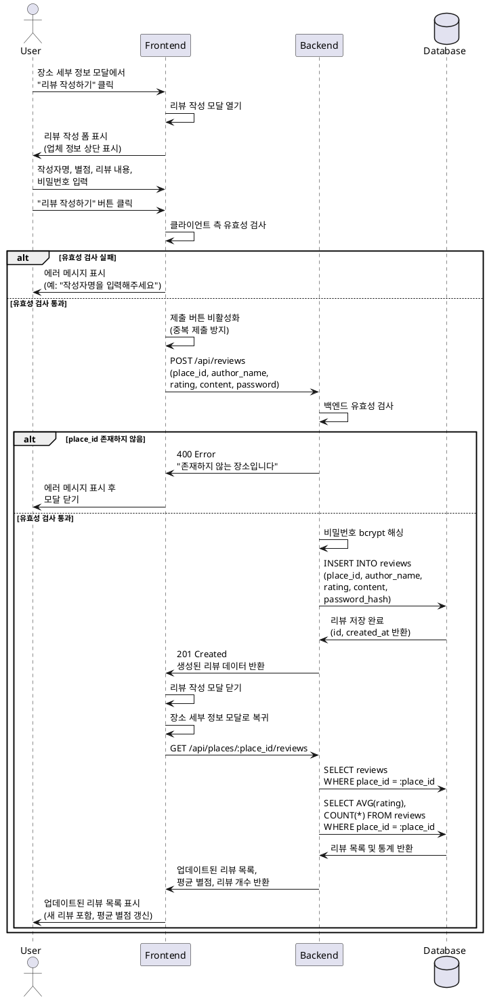

# 003. 리뷰 작성 플로우 - 상세 유스케이스

## Primary Actor
일반 사용자 (음식점을 방문하고 경험을 공유하려는 사용자)

## Precondition
- 사용자가 장소 세부 정보 모달을 열어 특정 음식점 정보를 조회한 상태
- 해당 장소가 places 테이블에 존재하는 상태

## Trigger
사용자가 [장소 세부 정보 모달]에서 "리뷰 작성하기" 버튼을 클릭

## Main Scenario

### 1. 리뷰 작성 진입
1. 사용자가 장소 세부 정보 모달에서 "리뷰 작성하기" 버튼을 클릭한다.
2. 시스템이 리뷰 작성 모달을 열고, 상단에 현재 장소의 기본 정보(업체명, 주소)를 표시한다.

### 2. 리뷰 정보 입력
사용자가 다음 항목을 입력한다:
- **작성자명**: 텍스트 입력 (필수, 최대 100자)
- **별점**: 1~5점 중 선택 (필수)
- **리뷰 내용**: 텍스트 영역 (필수, 최대 500자)
- **비밀번호**: 4자리 숫자 입력 (필수)

### 3. 리뷰 제출
1. 사용자가 모든 필수 항목을 입력하고 "리뷰 작성하기" 버튼을 클릭한다.
2. 시스템이 클라이언트 측 유효성 검사를 실행한다:
   - 작성자명: 필수 입력, 100자 이하
   - 별점: 1~5 범위 내 선택
   - 리뷰 내용: 필수 입력, 500자 이하
   - 비밀번호: 정확히 4자리 숫자
3. 유효성 검사 통과 시, 시스템이 백엔드 API `POST /api/reviews`를 호출한다.
4. 백엔드가 추가 유효성 검사를 실행한다:
   - place_id 존재 여부 확인
   - 모든 필드 형식 및 범위 재검증
5. 백엔드가 비밀번호를 bcrypt로 해싱한다.
6. 백엔드가 reviews 테이블에 리뷰 데이터를 저장한다.
7. 백엔드가 생성된 리뷰 데이터를 응답으로 반환한다.

### 4. 리뷰 작성 완료
1. 시스템이 리뷰 작성 모달을 닫는다.
2. 시스템이 장소 세부 정보 모달로 복귀한다.
3. 시스템이 `GET /api/places/:place_id/reviews`를 재호출하여 업데이트된 리뷰 목록을 조회한다.
4. 시스템이 새로 계산된 평균 별점과 총 리뷰 개수를 표시한다.
5. 사용자가 방금 작성한 리뷰를 포함한 전체 리뷰 목록을 확인한다.

## Edge Cases

### E1. 필수 항목 누락
**상황**: 사용자가 필수 항목(작성자명, 별점, 리뷰 내용, 비밀번호) 중 하나라도 입력하지 않은 상태에서 "리뷰 작성하기" 버튼을 클릭
- **처리**: 클라이언트 측 유효성 검사가 실패하고, 해당 필드에 에러 메시지를 표시한다 (예: "작성자명을 입력해주세요").
- **결과**: 리뷰 작성 모달이 유지되며, 사용자가 누락된 항목을 입력할 수 있다.

### E2. 리뷰 내용 글자 수 초과
**상황**: 사용자가 리뷰 내용을 500자를 초과하여 입력
- **처리**:
  - 실시간으로 글자 수를 표시하고 500자 초과 시 경고 메시지를 표시한다.
  - 제출 시 유효성 검사가 실패하고 "리뷰 내용은 500자를 초과할 수 없습니다 (현재: XXX자)" 메시지를 표시한다.
- **결과**: 사용자가 글자 수를 줄여 500자 이하로 수정할 수 있다.

### E3. 비밀번호 형식 오류
**상황**: 사용자가 4자리 숫자가 아닌 값을 비밀번호로 입력 (예: "abc1", "12345", "12 3")
- **처리**: 클라이언트 측 유효성 검사가 실패하고 "비밀번호는 4자리 숫자여야 합니다" 메시지를 표시한다.
- **결과**: 사용자가 올바른 형식으로 재입력할 수 있다.

### E4. 네트워크 오류
**상황**: 리뷰 제출 중 네트워크 오류 또는 서버 응답 실패
- **처리**: 에러 메시지를 표시하고 (예: "리뷰 작성에 실패했습니다. 다시 시도해주세요"), 입력된 데이터를 유지한다.
- **결과**: 사용자가 동일한 데이터로 재시도할 수 있다.

### E5. 장소가 존재하지 않음
**상황**: 백엔드에서 place_id로 장소 조회 시 해당 장소가 존재하지 않음
- **처리**: 백엔드가 400 에러와 "존재하지 않는 장소입니다" 메시지를 반환한다.
- **결과**: 프론트엔드가 에러 메시지를 표시하고 모달을 닫는다.

### E6. 모달 외부 클릭 또는 ESC 키
**상황**: 사용자가 리뷰 작성 중 모달 외부를 클릭하거나 ESC 키를 누름
- **처리**:
  - 입력된 데이터가 있는 경우: "작성 중인 내용이 있습니다. 정말 닫으시겠습니까?" 확인 대화상자를 표시한다.
  - 확인 시: 리뷰 작성 모달을 닫고 장소 세부 정보 모달로 복귀한다.
  - 취소 시: 리뷰 작성 모달을 유지한다.
- **결과**: 사용자의 의도를 재확인하여 실수로 인한 데이터 손실을 방지한다.

## Business Rules

### BR1. 데이터 유효성 규칙
- **작성자명**: 필수, 1~100자 이내
- **별점**: 필수, 1~5 정수 중 하나
- **리뷰 내용**: 필수, 1~500자 이내
- **비밀번호**: 필수, 정확히 4자리 숫자 (0000~9999)

### BR2. 비밀번호 보안
- 비밀번호는 평문으로 저장하지 않으며, bcrypt 알고리즘(salt rounds: 10)으로 해싱하여 저장한다.
- 비밀번호는 향후 리뷰 수정/삭제 시 본인 확인 용도로 사용된다.

### BR3. 리뷰 저장
- 리뷰는 Supabase의 reviews 테이블에 저장된다.
- 저장 시 created_at과 updated_at은 자동으로 현재 시각(UTC)으로 설정된다.
- place_id는 places 테이블의 유효한 레코드를 참조해야 한다 (Foreign Key 제약).

### BR4. 평균 별점 계산
- 평균 별점은 해당 장소의 모든 리뷰 별점의 산술 평균으로 계산된다.
- 소수점 첫째 자리까지 표시한다 (예: 4.5).
- 리뷰가 0개인 경우 평균 별점은 표시하지 않는다.

### BR5. 리뷰 정렬
- 리뷰 목록은 최신 작성 순(created_at DESC)으로 정렬하여 표시한다.

### BR6. 중복 제출 방지
- 리뷰 제출 버튼 클릭 시 버튼을 비활성화하고 로딩 상태를 표시하여 중복 제출을 방지한다.
- 응답 수신 후 버튼을 다시 활성화한다.

## Sequence Diagram

