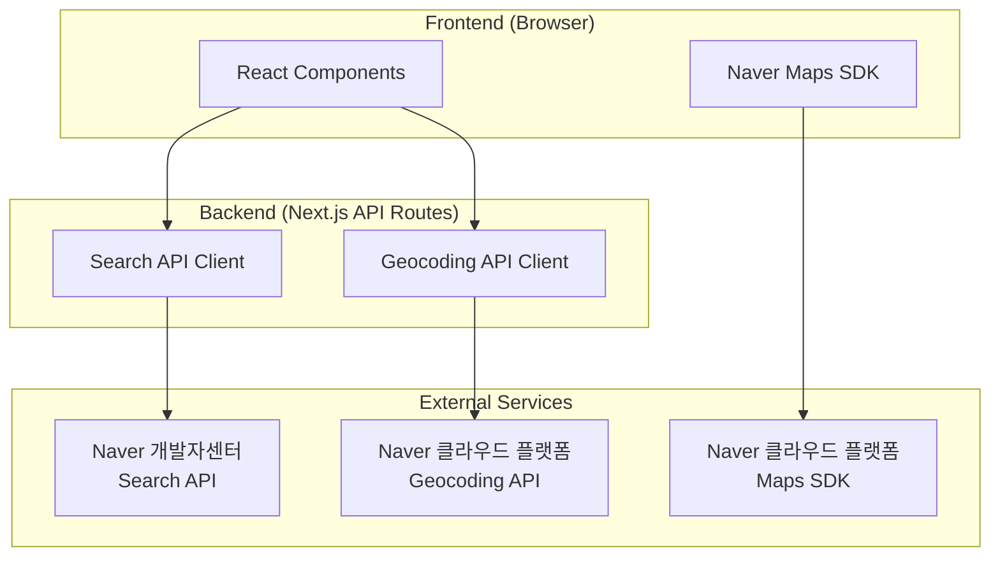

# 네이버 API 연동 통합 가이드

## 목차
1. [개요](#개요)
2. [네이버 개발자센터 vs 네이버 클라우드 플랫폼](#네이버-개발자센터-vs-네이버-클라우드-플랫폼)
3. [API별 인증 방식](#api별-인증-방식)
4. [아키텍처 설계](#아키텍처-설계)
5. [코드 구현 가이드](#코드-구현-가이드)
6. [트러블슈팅](#트러블슈팅)
7. [베스트 프랙티스](#베스트-프랙티스)

---

## 개요

이 프로젝트는 네이버의 **두 가지 독립적인 API 플랫폼**을 통합 사용합니다:



**핵심 포인트:**
- 검색 API는 네이버 개발자센터 인증 사용
- 지도/Geocoding API는 네이버 클라우드 플랫폼 인증 사용
- **절대 두 플랫폼의 API 키를 혼용하지 말 것**

---

## 네이버 개발자센터 vs 네이버 클라우드 플랫폼

### 차이점 비교

| 항목 | 네이버 개발자센터 | 네이버 클라우드 플랫폼 |
|------|-----------------|---------------------|
| **URL** | https://developers.naver.com | https://console.ncloud.com |
| **주요 서비스** | 검색, 로그인, Clova, Papago 등 | Maps, Geocoding, 클라우드 인프라 |
| **인증 방식** | Client ID + Client Secret | Access Key ID + Secret Key |
| **헤더명** | `X-Naver-Client-Id`<br/>`X-Naver-Client-Secret` | `X-NCP-APIGW-API-KEY-ID`<br/>`X-NCP-APIGW-API-KEY` |
| **무료 할당량** | 검색 API 일 25,000건 | Maps 월 100,000건<br/>Geocoding 월 100,000건 |
| **과금 방식** | API별 건당 과금 | 종량제 과금 |
| **계정** | 네이버 개인 계정 | 네이버 클라우드 계정 (결제 수단 필수) |

### 사용 목적에 따른 선택

| 기능 | 플랫폼 | API |
|------|-------|-----|
| 음식점 검색 | 네이버 개발자센터 | Search API (Local) |
| 지도 표시 | 네이버 클라우드 | Maps JavaScript SDK |
| 주소 → 좌표 변환 | 네이버 클라우드 | Geocoding API |
| 좌표 → 주소 변환 | 네이버 클라우드 | Reverse Geocoding API |

---

## API별 인증 방식

### 1. 네이버 검색 API (개발자센터)

**인증 헤더:**
```typescript
headers: {
  'X-Naver-Client-Id': process.env.NAVER_SEARCH_CLIENT_ID,
  'X-Naver-Client-Secret': process.env.NAVER_SEARCH_CLIENT_SECRET,
}
```

**API 엔드포인트:**
```
https://openapi.naver.com/v1/search/local.json
```

**환경 변수:**
- `NAVER_SEARCH_CLIENT_ID` (서버 전용)
- `NAVER_SEARCH_CLIENT_SECRET` (서버 전용)

**예시 요청:**
```typescript
const response = await fetch(
  `https://openapi.naver.com/v1/search/local.json?query=${encodeURIComponent(query)}&display=10`,
  {
    headers: {
      'X-Naver-Client-Id': process.env.NAVER_SEARCH_CLIENT_ID!,
      'X-Naver-Client-Secret': process.env.NAVER_SEARCH_CLIENT_SECRET!,
    },
  }
);
```

---

### 2. 네이버 지도 JavaScript SDK (클라우드 플랫폼)

**인증 방식:**
URL 파라미터로 Client ID 전달

**SDK 로드:**
```typescript
<Script
  strategy="afterInteractive"
  src={`https://oapi.map.naver.com/openapi/v3/maps.js?ncpKeyId=${process.env.NEXT_PUBLIC_NCP_CLIENT_ID}&submodules=geocoder`}
/>
```

**환경 변수:**
- `NEXT_PUBLIC_NCP_CLIENT_ID` (클라이언트 노출 가능)

**파라미터 설명:**
- `ncpKeyId`: 네이버 클라우드 Access Key ID (**구버전 `ncpClientId`는 더 이상 지원 안 됨**)
- `submodules`: 추가 모듈 (예: `geocoder` - 주소/좌표 변환 기능)

---

### 3. 네이버 Geocoding API (클라우드 플랫폼)

**인증 헤더:**
```typescript
headers: {
  'X-NCP-APIGW-API-KEY-ID': process.env.NCP_CLIENT_ID,
  'X-NCP-APIGW-API-KEY': process.env.NCP_CLIENT_SECRET,
}
```

**API 엔드포인트:**
```
# Geocoding (주소 → 좌표)
https://naveropenapi.apigw.ntruss.com/map-geocode/v2/geocode

# Reverse Geocoding (좌표 → 주소)
https://naveropenapi.apigw.ntruss.com/map-reversegeocode/v2/gc
```

**환경 변수:**
- `NCP_CLIENT_ID` (서버 전용)
- `NCP_CLIENT_SECRET` (서버 전용)

**예시 요청 (Geocoding):**
```typescript
const response = await fetch(
  `https://naveropenapi.apigw.ntruss.com/map-geocode/v2/geocode?query=${encodeURIComponent(address)}`,
  {
    headers: {
      'X-NCP-APIGW-API-KEY-ID': process.env.NCP_CLIENT_ID!,
      'X-NCP-APIGW-API-KEY': process.env.NCP_CLIENT_SECRET!,
    },
  }
);
```

**예시 요청 (Reverse Geocoding):**
```typescript
const coords = `${lng},${lat}`;
const response = await fetch(
  `https://naveropenapi.apigw.ntruss.com/map-reversegeocode/v2/gc?coords=${coords}&output=json&orders=roadaddr,addr`,
  {
    headers: {
      'X-NCP-APIGW-API-KEY-ID': process.env.NCP_CLIENT_ID!,
      'X-NCP-APIGW-API-KEY': process.env.NCP_CLIENT_SECRET!,
    },
  }
);
```

---

## 아키텍처 설계

### 환경 변수 네이밍 전략

```env
# 네이버 개발자센터
NAVER_SEARCH_CLIENT_ID        # 검색 API 클라이언트 ID
NAVER_SEARCH_CLIENT_SECRET    # 검색 API 시크릿

# 네이버 클라우드 플랫폼
NEXT_PUBLIC_NCP_CLIENT_ID     # 지도 SDK용 (클라이언트 노출)
NCP_CLIENT_ID                  # Geocoding API용 (서버 전용)
NCP_CLIENT_SECRET              # Geocoding API 시크릿 (서버 전용)
```

**네이밍 규칙:**
- `NAVER_*`: 네이버 개발자센터 API
- `NCP_*`: 네이버 클라우드 플랫폼 API
- `NEXT_PUBLIC_*`: 클라이언트에서 접근 가능
- 접두사 없음: 서버 전용

### 파일 구조

```
src/
├── lib/
│   └── remote/
│       ├── api-client.ts           # 공통 HTTP 클라이언트
│       └── naver-api-client.ts     # 네이버 API 전용 클라이언트
├── features/
│   ├── places/
│   │   ├── backend/
│   │   │   ├── route.ts            # Hono 라우터
│   │   │   └── service.ts          # 네이버 검색 API 호출
│   │   └── hooks/
│   │       └── usePlaces.ts        # React Query 훅
│   └── map/
│       └── components/
│           └── NaverMapContainer.tsx  # 지도 SDK 사용
```

---

## 코드 구현 가이드

### 1. API 클라이언트 구현

#### `src/lib/remote/naver-api-client.ts`

```typescript
/**
 * 네이버 개발자센터 검색 API 클라이언트
 * @see https://developers.naver.com/docs/search/blog/
 */
export async function naverSearchAPI(endpoint: string, params: Record<string, string>) {
  const url = new URL(`https://openapi.naver.com/v1/search/${endpoint}`);
  Object.entries(params).forEach(([key, value]) => url.searchParams.set(key, value));

  const response = await fetch(url, {
    headers: {
      'X-Naver-Client-Id': process.env.NAVER_SEARCH_CLIENT_ID!,
      'X-Naver-Client-Secret': process.env.NAVER_SEARCH_CLIENT_SECRET!,
    },
  });

  if (!response.ok) {
    throw new Error(`Naver Search API error: ${response.status}`);
  }

  return response.json();
}

/**
 * 네이버 클라우드 플랫폼 Geocoding API 클라이언트
 * @see https://api.ncloud-docs.com/docs/ai-naver-mapsgeocoding
 */
export async function ncpGeocodingAPI(address: string) {
  const url = new URL('https://naveropenapi.apigw.ntruss.com/map-geocode/v2/geocode');
  url.searchParams.set('query', address);

  const response = await fetch(url, {
    headers: {
      'X-NCP-APIGW-API-KEY-ID': process.env.NCP_CLIENT_ID!,
      'X-NCP-APIGW-API-KEY': process.env.NCP_CLIENT_SECRET!,
    },
  });

  if (!response.ok) {
    throw new Error(`NCP Geocoding API error: ${response.status}`);
  }

  return response.json();
}

/**
 * 네이버 클라우드 플랫폼 Reverse Geocoding API 클라이언트
 */
export async function ncpReverseGeocodingAPI(lat: number, lng: number) {
  const coords = `${lng},${lat}`;
  const url = new URL('https://naveropenapi.apigw.ntruss.com/map-reversegeocode/v2/gc');
  url.searchParams.set('coords', coords);
  url.searchParams.set('output', 'json');
  url.searchParams.set('orders', 'roadaddr,addr');

  const response = await fetch(url, {
    headers: {
      'X-NCP-APIGW-API-KEY-ID': process.env.NCP_CLIENT_ID!,
      'X-NCP-APIGW-API-KEY': process.env.NCP_CLIENT_SECRET!,
    },
  });

  if (!response.ok) {
    throw new Error(`NCP Reverse Geocoding API error: ${response.status}`);
  }

  return response.json();
}
```

---

### 2. 지도 SDK 로드 컴포넌트

#### `src/features/map/components/NaverMapScript.tsx`

```typescript
'use client';

import Script from 'next/script';

export function NaverMapScript() {
  const ncpClientId = process.env.NEXT_PUBLIC_NCP_CLIENT_ID;

  if (!ncpClientId) {
    console.error('NEXT_PUBLIC_NCP_CLIENT_ID is not defined');
    return null;
  }

  return (
    <Script
      strategy="afterInteractive"
      src={`https://oapi.map.naver.com/openapi/v3/maps.js?ncpKeyId=${ncpClientId}&submodules=geocoder`}
      onError={(e) => {
        console.error('Failed to load Naver Map SDK:', e);
      }}
      onLoad={() => {
        console.log('Naver Map SDK loaded successfully');
      }}
    />
  );
}
```

**사용법:**
```typescript
// src/app/layout.tsx
export default function RootLayout({ children }) {
  return (
    <html>
      <body>
        <NaverMapScript />
        {children}
      </body>
    </html>
  );
}
```

---

### 3. Backend API Route 구현

#### `src/features/places/backend/route.ts`

```typescript
import { Hono } from 'hono';
import type { AppEnv } from '@/backend/hono/context';
import { naverSearchAPI } from '@/lib/remote/naver-api-client';
import { respond, success, failure } from '@/backend/http/response';

export const registerPlacesRoutes = (app: Hono<AppEnv>) => {
  // 네이버 검색 API를 통한 음식점 검색
  app.get('/places/search', async (c) => {
    const query = c.req.query('query');

    if (!query) {
      return respond(c, failure(400, 'INVALID_QUERY', 'Query parameter is required'));
    }

    try {
      const data = await naverSearchAPI('local.json', {
        query,
        display: '10',
        sort: 'random',
      });

      return respond(c, success(data));
    } catch (error) {
      return respond(c, failure(500, 'SEARCH_ERROR', error.message));
    }
  });
};
```

---

### 4. 환경 변수 타입 검증

#### `src/backend/config/env.ts`

```typescript
import { z } from 'zod';

export const envSchema = z.object({
  // 네이버 개발자센터 API
  NAVER_SEARCH_CLIENT_ID: z.string().min(1, 'NAVER_SEARCH_CLIENT_ID is required'),
  NAVER_SEARCH_CLIENT_SECRET: z.string().min(1, 'NAVER_SEARCH_CLIENT_SECRET is required'),

  // 네이버 클라우드 플랫폼 - 서버용
  NCP_CLIENT_ID: z.string().min(1, 'NCP_CLIENT_ID is required'),
  NCP_CLIENT_SECRET: z.string().min(1, 'NCP_CLIENT_SECRET is required'),

  // 네이버 클라우드 플랫폼 - 클라이언트용
  NEXT_PUBLIC_NCP_CLIENT_ID: z.string().min(1, 'NEXT_PUBLIC_NCP_CLIENT_ID is required'),
});

export type Env = z.infer<typeof envSchema>;

// 앱 시작 시 환경 변수 검증
export function validateEnv() {
  const result = envSchema.safeParse(process.env);

  if (!result.success) {
    console.error('❌ Invalid environment variables:', result.error.format());
    throw new Error('Environment validation failed');
  }

  console.log('✅ Environment variables validated successfully');
  return result.data;
}
```

---

## 트러블슈팅

### 문제 1: 401 Unauthorized 에러

**증상:**
```json
{
  "errorMessage": "Authentication failed (인증에 실패했습니다.)",
  "errorCode": "024"
}
```

**원인 및 해결:**

| 원인 | 해결 방법 |
|------|----------|
| 잘못된 API 키 사용 | 개발자센터와 클라우드 플랫폼의 키를 혼용하지 않았는지 확인 |
| 환경 변수명 오타 | `.env.local` 파일의 변수명이 정확한지 확인 |
| 서버 재시작 안 함 | `npm run dev` 재실행 (환경 변수 변경 시 필수) |
| API 키 만료 | 네이버 콘솔에서 키 재발급 |

**디버깅 코드:**
```typescript
// 서버 측에서만 실행
console.log('Search API Key:', process.env.NAVER_SEARCH_CLIENT_ID?.slice(0, 5) + '...');
console.log('NCP API Key:', process.env.NCP_CLIENT_ID?.slice(0, 5) + '...');
```

---

### 문제 2: 네이버 지도 SDK 로드 실패

**증상:**
```
Uncaught ReferenceError: naver is not defined
```

**원인 및 해결:**

| 원인 | 해결 방법 |
|------|----------|
| SDK Script가 로드되지 않음 | 브라우저 Network 탭에서 `maps.js` 로드 확인 |
| 잘못된 파라미터명 사용 | `ncpClientId` → `ncpKeyId`로 수정 |
| `NEXT_PUBLIC_*` 환경 변수 누락 | `.env.local`에 `NEXT_PUBLIC_NCP_CLIENT_ID` 추가 |
| Script 로드 타이밍 이슈 | `strategy="afterInteractive"` 사용 확인 |

**해결 예시:**
```typescript
// ❌ 잘못된 예
src={`https://oapi.map.naver.com/openapi/v3/maps.js?ncpClientId=${process.env.NEXT_PUBLIC_NAVER_CLIENT_ID}`}

// ✅ 올바른 예
src={`https://oapi.map.naver.com/openapi/v3/maps.js?ncpKeyId=${process.env.NEXT_PUBLIC_NCP_CLIENT_ID}&submodules=geocoder`}
```

---

### 문제 3: CORS 에러

**증상:**
```
Access to fetch at 'https://openapi.naver.com/...' from origin 'http://localhost:3000' has been blocked by CORS policy
```

**해결 방법:**

1. **네이버 개발자센터 설정:**
   - Application 설정 > Web 서비스 URL에 `http://localhost:3000` 추가

2. **네이버 클라우드 플랫폼 설정:**
   - Application 설정 > 서비스 URL에 `http://localhost:3000` 추가

3. **프로덕션 배포 시:**
   - 실제 도메인 (예: `https://myapp.vercel.app`) 등록

---

### 문제 4: API 호출 제한 초과 (429 에러)

**증상:**
```json
{
  "errorMessage": "Quota Exceeded (호출 한도를 초과했습니다.)",
  "errorCode": "429"
}
```

**해결 방법:**

1. **사용량 확인:**
   - 네이버 개발자센터: 통계 메뉴
   - 네이버 클라우드: 콘솔 > 사용량 모니터링

2. **캐싱 전략 적용:**
   ```typescript
   // React Query 캐싱 예시
   useQuery({
     queryKey: ['places', query],
     queryFn: () => searchPlaces(query),
     staleTime: 5 * 60 * 1000, // 5분간 캐시 유지
     gcTime: 10 * 60 * 1000,   // 10분간 메모리 보관
   });
   ```

3. **요청 횟수 줄이기:**
   - Debouncing 적용 (검색 입력 시)
   - 페이지네이션 적용
   - 불필요한 API 호출 제거

---

## 베스트 프랙티스

### 1. 환경 변수 관리

✅ **권장:**
```typescript
// 타입 안전성 확보
const ncpClientId = process.env.NEXT_PUBLIC_NCP_CLIENT_ID;
if (!ncpClientId) {
  throw new Error('NEXT_PUBLIC_NCP_CLIENT_ID is required');
}
```

❌ **비권장:**
```typescript
// 타입 체크 없이 사용
const url = `...?ncpKeyId=${process.env.NEXT_PUBLIC_NCP_CLIENT_ID}`;
```

---

### 2. API 호출 에러 처리

✅ **권장:**
```typescript
try {
  const data = await naverSearchAPI('local.json', { query });
  return success(data);
} catch (error) {
  logger.error('Search API failed', error);
  return failure(500, 'SEARCH_ERROR', error.message);
}
```

❌ **비권장:**
```typescript
const data = await naverSearchAPI('local.json', { query }); // 에러 처리 없음
return success(data);
```

---

### 3. React Query 캐싱 전략

```typescript
// 지도 마커 데이터 (자주 변경되지 않음)
usePlacesWithReviews() → {
  staleTime: 5 * 60 * 1000,  // 5분
  gcTime: 10 * 60 * 1000,    // 10분
}

// 검색 결과 (실시간성 중요)
useSearchPlaces(query) → {
  staleTime: 30 * 1000,      // 30초
  gcTime: 2 * 60 * 1000,     // 2분
}

// 리뷰 데이터 (중간 수준)
usePlaceReviews(placeId) → {
  staleTime: 1 * 60 * 1000,  // 1분
  gcTime: 5 * 60 * 1000,     // 5분
}
```

---

### 4. 보안 체크리스트

- [ ] `.env*.local` 파일이 `.gitignore`에 포함되어 있는가?
- [ ] `NEXT_PUBLIC_*` 환경 변수에 Secret 키가 없는가?
- [ ] API 키를 콘솔에 출력하지 않는가?
- [ ] 프로덕션 환경에서 환경 변수를 안전하게 관리하는가?
- [ ] HTTP Referer 제한이 설정되어 있는가?
- [ ] API 사용량을 주기적으로 모니터링하는가?

---

### 5. 성능 최적화

```typescript
// 1. API 호출 Debouncing
const debouncedSearch = debounce((query: string) => {
  searchPlaces(query);
}, 300);

// 2. 마커 메모이제이션
export const PlaceMarker = memo(({ place }) => {
  // ...
}, (prev, next) => prev.place.id === next.place.id);

// 3. React Query Prefetching
const queryClient = useQueryClient();

// 마커에 마우스 올리면 미리 데이터 로드
const handleMarkerHover = (placeId: string) => {
  queryClient.prefetchQuery({
    queryKey: ['places', placeId, 'reviews'],
    queryFn: () => fetchPlaceReviews(placeId),
  });
};
```

---

## 참고 자료

### 공식 문서
- [네이버 개발자센터 - 검색 API](https://developers.naver.com/docs/search/blog/)
- [네이버 클라우드 - Maps API](https://api.ncloud-docs.com/docs/ai-naver-mapsstatic)
- [네이버 클라우드 - Geocoding API](https://api.ncloud-docs.com/docs/ai-naver-mapsgeocoding)
- [Next.js 환경 변수](https://nextjs.org/docs/app/building-your-application/configuring/environment-variables)

### 추가 리소스
- [환경 변수 설정 가이드](./environment-variables.md)
- [네이버 지도 SDK 가이드](./naver_map_SDK.md)
