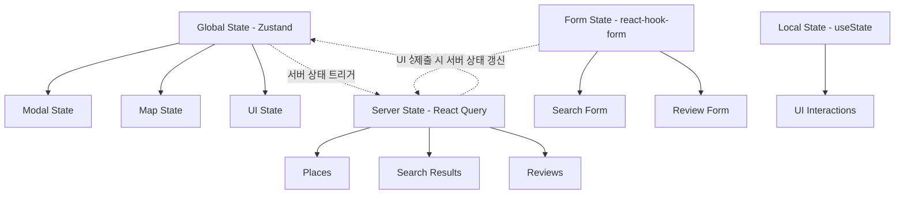
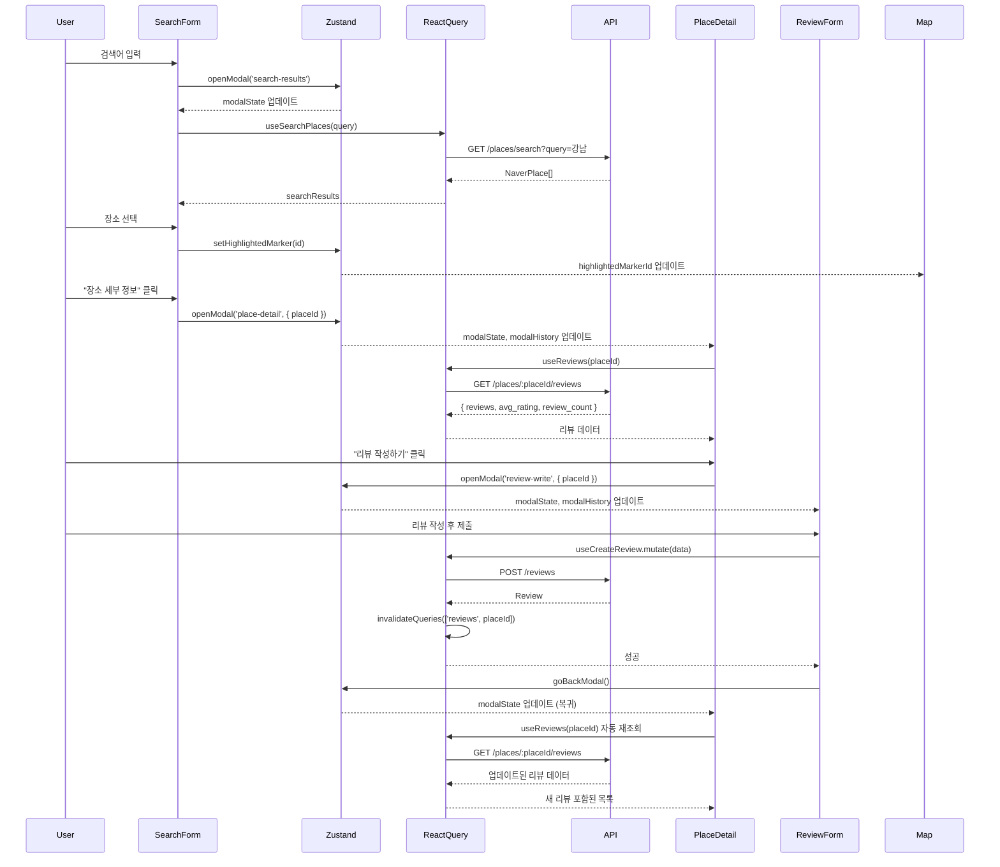
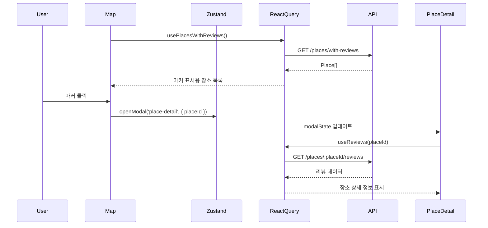

# 음식점 리뷰 사이트 상태관리 설계

## 1. State Inventory

### 1.1 Domain State (서버 데이터)
서버에서 가져온 비즈니스 도메인 데이터로, React Query로 관리됩니다.

```typescript
// Place 관련
places: Place[]                    // 리뷰가 있는 모든 장소 (지도 마커용)
selectedPlace: Place | null        // 현재 선택된 장소 상세 정보
searchResults: NaverPlace[]        // 네이버 장소 검색 결과

// Review 관련
reviews: Review[]                  // 특정 장소의 리뷰 목록
reviewStats: ReviewStats           // 평균 별점 및 리뷰 개수

// Type Definitions
interface Place {
  id: string
  naver_place_id: string
  name: string
  address: string
  phone: string | null
  latitude: number
  longitude: number
  created_at: string
  updated_at: string
}

interface NaverPlace {
  id: string                       // 네이버 place_id
  name: string
  address: string
  phone?: string
  latitude: number
  longitude: number
}

interface Review {
  id: string
  place_id: string
  author_name: string
  rating: number                   // 1~5
  content: string                  // max 500자
  created_at: string
}

interface ReviewStats {
  avg_rating: number               // 평균 별점
  review_count: number             // 총 리뷰 개수
}
```

### 1.2 UI State (화면 제어)
전역 UI 상태로, Zustand로 관리됩니다.

```typescript
// Modal 상태
modalState: 'closed' | 'search-results' | 'place-detail' | 'review-write'

// Modal Navigation Stack (복귀 로직용)
modalHistory: ModalHistoryItem[]

// Map 상태
highlightedMarkerId: string | null  // 강조 표시할 마커 ID
mapCenter: { lat: number; lng: number }  // 지도 중심 좌표

// Loading/Error 상태
status: 'idle' | 'loading' | 'success' | 'error'
error: string | null

// Type Definitions
interface ModalHistoryItem {
  type: 'search-results' | 'place-detail'
  data?: {
    placeId?: string
    naverPlaceId?: string
    searchQuery?: string
  }
}
```

### 1.3 Form State (사용자 입력)
폼 입력 상태로, react-hook-form으로 관리됩니다.

```typescript
// 검색 폼
searchQuery: string                 // 검색어

// 리뷰 작성 폼
reviewForm: {
  author_name: string               // 작성자명 (필수)
  rating: number                    // 1~5 (필수)
  content: string                   // 최대 500자 (필수)
  password: string                  // 4자리 숫자 (필수)
}

// 폼 상태
isSubmitting: boolean
validationErrors: Record<string, string>
```

### 1.4 Derived State (계산 가능한 상태)
다른 상태로부터 계산되므로 별도 저장하지 않습니다.

```typescript
// 검색 결과의 지도 마커 좌표 배열
// → searchResults.map(r => ({ lat: r.latitude, lng: r.longitude }))

// 선택된 장소의 평균 별점 표시 (★★★★☆)
// → reviews를 기반으로 계산: Math.round(reviewStats.avg_rating)

// 리뷰 작성 폼의 유효성 검사 결과
// → react-hook-form의 formState.isValid

// 현재 모달이 열려있는지 여부
// → modalState !== 'closed'

// 직전 모달 타입 (복귀용)
// → modalHistory[modalHistory.length - 1]?.type
```

---

## 2. State Transitions

### 2.1 장소 검색 플로우

| Current State | Trigger (Action) | Next State | UI Impact |
|--------------|------------------|------------|-----------|
| `modalState: 'closed'` | 검색 버튼 클릭 (검색어 입력) | `modalState: 'search-results'`<br>`status: 'loading'` | 로딩 스피너 표시 |
| `status: 'loading'` | 네이버 API 응답 성공 | `status: 'success'`<br>`searchResults: NaverPlace[]` | 검색 결과 리스트 표시 |
| `status: 'loading'` | 네이버 API 응답 실패 | `status: 'error'`<br>`error: 'API 오류 메시지'` | 에러 메시지 표시 |
| `modalState: 'search-results'` | 리스트 항목 선택 | `highlightedMarkerId: place.id` | 지도 마커 강조 표시 |
| `modalState: 'search-results'` | "장소 세부 정보" 버튼 클릭 | `modalState: 'place-detail'`<br>`modalHistory.push()` | 장소 상세 모달 표시 |
| `modalState: 'search-results'` | 모달 외부 클릭 | `modalState: 'closed'`<br>`modalHistory: []` | 메인 지도 화면 복귀 |

### 2.2 장소 상세 정보 플로우

| Current State | Trigger (Action) | Next State | UI Impact |
|--------------|------------------|------------|-----------|
| `modalState: 'place-detail'` | 장소 ID로 진입 (마커/검색) | `status: 'loading'` | 로딩 스피너 표시 |
| `status: 'loading'` | 리뷰 조회 API 성공 | `status: 'success'`<br>`reviews: Review[]`<br>`reviewStats: ReviewStats` | 장소 정보, 리뷰 목록, 평균 별점 표시 |
| `modalState: 'place-detail'` | "리뷰 작성하기" 버튼 클릭 | `modalState: 'review-write'`<br>`modalHistory.push()` | 리뷰 작성 모달 표시 |
| `modalState: 'place-detail'` | 모달 닫기 | `modalState: 'search-results'` (검색 진입 시)<br>또는 `modalState: 'closed'` (마커 진입 시)<br>`modalHistory.pop()` | 직전 상태로 복귀 |

### 2.3 리뷰 작성 플로우

| Current State | Trigger (Action) | Next State | UI Impact |
|--------------|------------------|------------|-----------|
| `modalState: 'review-write'` | 폼 입력 | `reviewForm` 각 필드 업데이트<br>`validationErrors` 실시간 검증 | 입력 필드 에러 메시지 표시 |
| `modalState: 'review-write'` | "리뷰 작성하기" 버튼 클릭 (유효성 실패) | `validationErrors` 업데이트 | 에러 메시지 하이라이트 |
| `modalState: 'review-write'` | "리뷰 작성하기" 버튼 클릭 (유효성 성공) | `isSubmitting: true`<br>`status: 'loading'` | 버튼 비활성화, 로딩 표시 |
| `status: 'loading'` | 리뷰 저장 API 성공 | `status: 'success'`<br>`modalState: 'place-detail'`<br>`modalHistory.pop()` | 장소 상세 모달로 복귀, 리뷰 목록 자동 갱신 |
| `status: 'loading'` | 리뷰 저장 API 실패 | `status: 'error'`<br>`error: 'API 오류 메시지'`<br>`isSubmitting: false` | 에러 메시지 표시, 폼 재입력 가능 |

### 2.4 지도 마커 플로우

| Current State | Trigger (Action) | Next State | UI Impact |
|--------------|------------------|------------|-----------|
| `modalState: 'closed'` | 페이지 로드 | `status: 'loading'` | 지도 초기화 (강남역 중심) |
| `status: 'loading'` | 리뷰 있는 장소 조회 API 성공 | `status: 'success'`<br>`places: Place[]` | 지도에 커스텀 마커 표시 |
| `modalState: 'closed'` | 지도 마커 클릭 | `modalState: 'place-detail'`<br>`selectedPlace: Place` | 장소 상세 모달 표시 |
| `highlightedMarkerId: null` | 검색 결과 항목 선택 | `highlightedMarkerId: place.id`<br>`mapCenter: { lat, lng }` | 마커 강조 + 지도 중심 이동 |

---

## 3. Context Structure

### 3.1 상태 관리 계층 구조

```
┌─────────────────────────────────────────────────────┐
│                  Global State                        │
│                    (Zustand)                         │
│  - Modal 상태 (modalState, modalHistory)             │
│  - Map 상태 (highlightedMarkerId, mapCenter)         │
│  - UI 상태 (status, error)                           │
└─────────────────────────────────────────────────────┘
                         │
                         ▼
┌─────────────────────────────────────────────────────┐
│               Server State                           │
│              (React Query)                           │
│  - places (지도 마커용)                               │
│  - searchResults (검색 결과)                          │
│  - selectedPlace (장소 상세)                          │
│  - reviews (리뷰 목록)                                │
│  - reviewStats (리뷰 통계)                            │
└─────────────────────────────────────────────────────┘
                         │
                         ▼
┌─────────────────────────────────────────────────────┐
│                 Form State                           │
│            (react-hook-form)                         │
│  - searchQuery (검색 폼)                              │
│  - reviewForm (리뷰 작성 폼)                          │
└─────────────────────────────────────────────────────┘
                         │
                         ▼
┌─────────────────────────────────────────────────────┐
│                Local Component State                 │
│                   (useState)                         │
│  - 개별 UI 인터랙션 (hover, focus 등)                 │
│  - 임시 로컬 데이터 (애니메이션 상태 등)               │
└─────────────────────────────────────────────────────┘
```

### 3.2 Mermaid 계층도



### 3.3 상태 관리 방법

#### Global State (Zustand)
```typescript
// src/stores/useAppStore.ts
interface AppState {
  // Modal 관리
  modalState: ModalState
  modalHistory: ModalHistoryItem[]
  openModal: (type: ModalState, data?: any) => void
  closeModal: () => void
  goBackModal: () => void

  // Map 관리
  highlightedMarkerId: string | null
  mapCenter: { lat: number; lng: number }
  setHighlightedMarker: (id: string | null) => void
  setMapCenter: (lat: number, lng: number) => void

  // UI 상태
  status: Status
  error: string | null
  setStatus: (status: Status) => void
  setError: (error: string | null) => void
}

const useAppStore = create<AppState>((set, get) => ({
  modalState: 'closed',
  modalHistory: [],
  highlightedMarkerId: null,
  mapCenter: { lat: 37.498095, lng: 127.027610 }, // 강남역
  status: 'idle',
  error: null,

  openModal: (type, data) => set((state) => ({
    modalState: type,
    modalHistory: [...state.modalHistory, { type, data }]
  })),

  closeModal: () => set({
    modalState: 'closed',
    modalHistory: []
  }),

  goBackModal: () => set((state) => {
    const newHistory = [...state.modalHistory]
    newHistory.pop() // 현재 모달 제거
    const prevModal = newHistory[newHistory.length - 1]

    return {
      modalState: prevModal?.type || 'closed',
      modalHistory: newHistory
    }
  }),

  setHighlightedMarker: (id) => set({ highlightedMarkerId: id }),
  setMapCenter: (lat, lng) => set({ mapCenter: { lat, lng } }),
  setStatus: (status) => set({ status }),
  setError: (error) => set({ error })
}))
```

#### Feature State (React Query)
```typescript
// src/features/places/hooks/usePlaces.ts
export const usePlacesWithReviews = () => {
  return useQuery({
    queryKey: ['places', 'with-reviews'],
    queryFn: async () => {
      const response = await apiClient.get<Place[]>('/places/with-reviews')
      return response.data
    },
    staleTime: 5 * 60 * 1000, // 5분
    gcTime: 10 * 60 * 1000    // 10분
  })
}

export const useSearchPlaces = (query: string) => {
  return useQuery({
    queryKey: ['places', 'search', query],
    queryFn: async () => {
      const response = await apiClient.get<NaverPlace[]>('/places/search', {
        params: { query }
      })
      return response.data
    },
    enabled: !!query,
    staleTime: 1 * 60 * 1000  // 1분
  })
}

// src/features/reviews/hooks/useReviews.ts
export const useReviews = (placeId: string) => {
  return useQuery({
    queryKey: ['reviews', placeId],
    queryFn: async () => {
      const response = await apiClient.get<{
        reviews: Review[]
        avg_rating: number
        review_count: number
      }>(`/places/${placeId}/reviews`)
      return response.data
    },
    enabled: !!placeId,
    staleTime: 30 * 1000      // 30초
  })
}

export const useCreateReview = () => {
  const queryClient = useQueryClient()

  return useMutation({
    mutationFn: async (data: CreateReviewInput) => {
      const response = await apiClient.post<Review>('/reviews', data)
      return response.data
    },
    onSuccess: (_, variables) => {
      // 리뷰 목록 무효화 (자동 재조회)
      queryClient.invalidateQueries({
        queryKey: ['reviews', variables.place_id]
      })
    }
  })
}
```

#### Local State (react-hook-form)
```typescript
// src/features/reviews/components/ReviewWriteModal.tsx
const reviewFormSchema = z.object({
  author_name: z.string()
    .min(1, '작성자명을 입력해주세요')
    .max(100, '작성자명은 100자를 초과할 수 없습니다'),
  rating: z.number()
    .int()
    .min(1, '별점을 선택해주세요')
    .max(5, '별점은 1~5 사이여야 합니다'),
  content: z.string()
    .min(1, '리뷰 내용을 입력해주세요')
    .max(500, '리뷰 내용은 500자를 초과할 수 없습니다'),
  password: z.string()
    .regex(/^\d{4}$/, '비밀번호는 4자리 숫자여야 합니다')
})

const ReviewWriteModal = ({ placeId }: { placeId: string }) => {
  const { goBackModal } = useAppStore()
  const createReview = useCreateReview()

  const form = useForm<ReviewFormData>({
    resolver: zodResolver(reviewFormSchema),
    defaultValues: {
      author_name: '',
      rating: 0,
      content: '',
      password: ''
    }
  })

  const onSubmit = async (data: ReviewFormData) => {
    try {
      await createReview.mutateAsync({
        place_id: placeId,
        ...data
      })
      goBackModal() // 성공 시 장소 상세 모달로 복귀
    } catch (error) {
      form.setError('root', {
        message: '리뷰 작성에 실패했습니다'
      })
    }
  }

  return (
    <form onSubmit={form.handleSubmit(onSubmit)}>
      {/* 폼 필드 */}
    </form>
  )
}
```

---

## 4. Types

### 4.1 Global State Types

```typescript
// src/stores/types.ts
type ModalState = 'closed' | 'search-results' | 'place-detail' | 'review-write'

type Status = 'idle' | 'loading' | 'success' | 'error'

interface ModalHistoryItem {
  type: Exclude<ModalState, 'closed'>
  data?: {
    placeId?: string
    naverPlaceId?: string
    searchQuery?: string
  }
}

interface AppState {
  // Modal
  modalState: ModalState
  modalHistory: ModalHistoryItem[]
  openModal: (type: Exclude<ModalState, 'closed'>, data?: any) => void
  closeModal: () => void
  goBackModal: () => void

  // Map
  highlightedMarkerId: string | null
  mapCenter: { lat: number; lng: number }
  setHighlightedMarker: (id: string | null) => void
  setMapCenter: (lat: number, lng: number) => void

  // UI
  status: Status
  error: string | null
  setStatus: (status: Status) => void
  setError: (error: string | null) => void
}
```

### 4.2 Domain Types

```typescript
// src/features/places/types.ts
interface Place {
  id: string
  naver_place_id: string
  name: string
  address: string
  phone: string | null
  latitude: number
  longitude: number
  created_at: string
  updated_at: string
}

interface NaverPlace {
  id: string                        // 네이버 place_id
  name: string
  address: string
  phone?: string
  latitude: number
  longitude: number
}

// src/features/reviews/types.ts
interface Review {
  id: string
  place_id: string
  author_name: string
  rating: number
  content: string
  created_at: string
}

interface ReviewStats {
  avg_rating: number
  review_count: number
}

interface CreateReviewInput {
  place_id: string
  author_name: string
  rating: number
  content: string
  password: string
}

interface ReviewFormData {
  author_name: string
  rating: number
  content: string
  password: string
}
```

---

## 5. Action Payloads

### 5.1 Modal Actions

```typescript
// 모달 열기
interface OpenModalPayload {
  type: 'search-results' | 'place-detail' | 'review-write'
  data?: {
    placeId?: string
    naverPlaceId?: string
    searchQuery?: string
  }
}

// 모달 닫기 (payload 없음)
type CloseModalPayload = void

// 모달 뒤로가기 (payload 없음)
type GoBackModalPayload = void
```

### 5.2 Map Actions

```typescript
// 마커 강조
interface SetHighlightedMarkerPayload {
  id: string | null
}

// 지도 중심 이동
interface SetMapCenterPayload {
  lat: number
  lng: number
}
```

### 5.3 React Query Actions

```typescript
// 장소 검색
interface SearchPlacesPayload {
  query: string
}

// 리뷰 조회
interface FetchReviewsPayload {
  placeId: string
}

// 리뷰 생성
interface CreateReviewPayload {
  place_id: string
  author_name: string
  rating: number
  content: string
  password: string
}

// 리뷰 생성 성공
interface CreateReviewSuccessPayload {
  review: Review
}

// API 실패
interface ApiFailurePayload {
  error: string
}
```

---

## 6. Initial State

### 6.1 Global State (Zustand)

```typescript
const initialAppState: AppState = {
  modalState: 'closed',
  modalHistory: [],
  highlightedMarkerId: null,
  mapCenter: {
    lat: 37.498095,     // 강남역 위도
    lng: 127.027610     // 강남역 경도
  },
  status: 'idle',
  error: null
}
```

### 6.2 Server State (React Query)

```typescript
// React Query는 자체적으로 초기 상태를 관리하므로 별도 정의 불필요
// 각 쿼리의 초기 상태는 다음과 같음:
{
  data: undefined,
  isLoading: false,
  isError: false,
  error: null
}
```

### 6.3 Form State (react-hook-form)

```typescript
const initialReviewFormState: ReviewFormData = {
  author_name: '',
  rating: 0,
  content: '',
  password: ''
}

const initialSearchFormState = {
  query: ''
}
```

---

## 7. 상태 간 데이터 흐름

### 7.1 검색 → 장소 상세 → 리뷰 작성 플로우



### 7.2 지도 마커 클릭 플로우



### 7.3 데이터 동기화 전략

#### React Query Invalidation
리뷰 작성/수정/삭제 시 관련 쿼리를 무효화하여 자동 재조회:

```typescript
// 리뷰 작성 성공 시
queryClient.invalidateQueries({
  queryKey: ['reviews', placeId]
})

// 장소 추가 시 (리뷰 작성으로 새 장소 추가된 경우)
queryClient.invalidateQueries({
  queryKey: ['places', 'with-reviews']
})
```

#### Optimistic Update (선택적 구현)
리뷰 작성 시 즉시 UI 업데이트 후 서버 동기화:

```typescript
const createReview = useMutation({
  mutationFn: postReview,
  onMutate: async (newReview) => {
    // 진행 중인 쿼리 취소
    await queryClient.cancelQueries({ queryKey: ['reviews', newReview.place_id] })

    // 이전 데이터 백업
    const previousReviews = queryClient.getQueryData(['reviews', newReview.place_id])

    // 낙관적 업데이트
    queryClient.setQueryData(['reviews', newReview.place_id], (old) => ({
      ...old,
      reviews: [...old.reviews, { ...newReview, id: 'temp-id', created_at: new Date() }],
      review_count: old.review_count + 1
    }))

    return { previousReviews }
  },
  onError: (err, newReview, context) => {
    // 에러 시 롤백
    queryClient.setQueryData(['reviews', newReview.place_id], context.previousReviews)
  },
  onSettled: (data, error, variables) => {
    // 완료 후 재조회
    queryClient.invalidateQueries({ queryKey: ['reviews', variables.place_id] })
  }
})
```

---

## 8. 성능 최적화

### 8.1 메모이제이션 전략

#### Zustand Selectors
불필요한 리렌더링 방지:

```typescript
// ❌ 나쁜 예: 전체 상태 구독
const state = useAppStore()

// ✅ 좋은 예: 필요한 부분만 선택
const modalState = useAppStore((state) => state.modalState)
const openModal = useAppStore((state) => state.openModal)
```

#### React.memo
```typescript
// 지도 마커 컴포넌트 - props가 변경될 때만 리렌더링
const PlaceMarker = React.memo(({ place, isHighlighted }: Props) => {
  return (
    <NaverMapMarker
      position={{ lat: place.latitude, lng: place.longitude }}
      icon={isHighlighted ? highlightedIcon : defaultIcon}
    />
  )
}, (prevProps, nextProps) => {
  return prevProps.place.id === nextProps.place.id &&
         prevProps.isHighlighted === nextProps.isHighlighted
})
```

#### useMemo / useCallback
```typescript
const PlaceDetailModal = ({ placeId }: Props) => {
  const { data: reviewData } = useReviews(placeId)

  // 평균 별점 표시 계산 - reviews가 변경될 때만 재계산
  const starRating = useMemo(() => {
    if (!reviewData) return 0
    return Math.round(reviewData.avg_rating)
  }, [reviewData])

  // 이벤트 핸들러 - 재생성 방지
  const handleReviewWrite = useCallback(() => {
    openModal('review-write', { placeId })
  }, [placeId, openModal])

  return (
    <div>
      <StarDisplay rating={starRating} />
      <button onClick={handleReviewWrite}>리뷰 작성하기</button>
    </div>
  )
}
```

### 8.2 React Query 캐싱 전략

#### Stale Time & GC Time
```typescript
const queryClient = new QueryClient({
  defaultOptions: {
    queries: {
      staleTime: 60 * 1000,        // 1분: 이 시간 동안 fresh 상태 유지
      gcTime: 5 * 60 * 1000,       // 5분: 이 시간 후 캐시에서 제거
      retry: 1,                     // 실패 시 1회만 재시도
      refetchOnWindowFocus: false   // 윈도우 포커스 시 자동 재조회 비활성화
    }
  }
})

// 개별 쿼리별 설정
const usePlacesWithReviews = () => {
  return useQuery({
    queryKey: ['places', 'with-reviews'],
    queryFn: fetchPlacesWithReviews,
    staleTime: 5 * 60 * 1000,      // 5분: 지도 마커는 자주 변경되지 않음
    gcTime: 10 * 60 * 1000         // 10분
  })
}

const useReviews = (placeId: string) => {
  return useQuery({
    queryKey: ['reviews', placeId],
    queryFn: () => fetchReviews(placeId),
    staleTime: 30 * 1000,           // 30초: 리뷰는 비교적 자주 확인
    gcTime: 2 * 60 * 1000           // 2분
  })
}

const useSearchPlaces = (query: string) => {
  return useQuery({
    queryKey: ['places', 'search', query],
    queryFn: () => searchPlaces(query),
    staleTime: 1 * 60 * 1000,       // 1분: 검색 결과는 빠르게 stale
    gcTime: 5 * 60 * 1000,          // 5분
    enabled: !!query                 // 검색어가 있을 때만 실행
  })
}
```

#### Prefetching
```typescript
// 검색 결과 리스트에서 호버 시 미리 가져오기
const SearchResultItem = ({ place }: Props) => {
  const queryClient = useQueryClient()

  const handleMouseEnter = () => {
    queryClient.prefetchQuery({
      queryKey: ['reviews', place.id],
      queryFn: () => fetchReviews(place.id),
      staleTime: 30 * 1000
    })
  }

  return (
    <div onMouseEnter={handleMouseEnter}>
      {place.name}
    </div>
  )
}
```

### 8.3 리렌더링 최적화

#### 상태 분리
```typescript
// ❌ 나쁜 예: 하나의 큰 상태 객체
interface AppState {
  modal: { state: ModalState; history: ModalHistoryItem[] }
  map: { highlightedId: string | null; center: { lat: number; lng: number } }
  ui: { status: Status; error: string | null }
}

// ✅ 좋은 예: 독립적인 상태로 분리
const useModalStore = create<ModalState>(...)
const useMapStore = create<MapState>(...)
const useUIStore = create<UIState>(...)
```

#### Virtual Scrolling
리뷰 목록이 많을 경우:

```typescript
import { useVirtualizer } from '@tanstack/react-virtual'

const ReviewList = ({ reviews }: Props) => {
  const parentRef = useRef<HTMLDivElement>(null)

  const virtualizer = useVirtualizer({
    count: reviews.length,
    getScrollElement: () => parentRef.current,
    estimateSize: () => 120  // 각 리뷰 아이템의 예상 높이
  })

  return (
    <div ref={parentRef} style={{ height: '400px', overflow: 'auto' }}>
      <div style={{ height: `${virtualizer.getTotalSize()}px` }}>
        {virtualizer.getVirtualItems().map((virtualItem) => (
          <ReviewItem
            key={virtualItem.key}
            review={reviews[virtualItem.index]}
            style={{
              position: 'absolute',
              top: 0,
              left: 0,
              width: '100%',
              transform: `translateY(${virtualItem.start}px)`
            }}
          />
        ))}
      </div>
    </div>
  )
}
```

---

## 9. 에러 처리 전략

### 9.1 React Query Error Boundaries

```typescript
// src/components/ErrorBoundary.tsx
import { QueryErrorResetBoundary } from '@tanstack/react-query'
import { ErrorBoundary as ReactErrorBoundary } from 'react-error-boundary'

const ErrorFallback = ({ error, resetErrorBoundary }: Props) => {
  return (
    <div>
      <h2>오류가 발생했습니다</h2>
      <p>{error.message}</p>
      <button onClick={resetErrorBoundary}>다시 시도</button>
    </div>
  )
}

export const ErrorBoundary = ({ children }: Props) => {
  return (
    <QueryErrorResetBoundary>
      {({ reset }) => (
        <ReactErrorBoundary
          onReset={reset}
          FallbackComponent={ErrorFallback}
        >
          {children}
        </ReactErrorBoundary>
      )}
    </QueryErrorResetBoundary>
  )
}
```

### 9.2 글로벌 에러 핸들러

```typescript
// src/lib/remote/api-client.ts
import axios from 'axios'
import { useAppStore } from '@/stores/useAppStore'

export const apiClient = axios.create({
  baseURL: '/api'
})

apiClient.interceptors.response.use(
  (response) => response,
  (error) => {
    const setError = useAppStore.getState().setError
    const setStatus = useAppStore.getState().setStatus

    setStatus('error')

    if (error.response) {
      // 서버 응답 에러
      setError(error.response.data.message || '서버 오류가 발생했습니다')
    } else if (error.request) {
      // 네트워크 에러
      setError('네트워크 연결을 확인해주세요')
    } else {
      // 기타 에러
      setError('알 수 없는 오류가 발생했습니다')
    }

    return Promise.reject(error)
  }
)
```

### 9.3 폼 에러 처리

```typescript
// react-hook-form의 에러 핸들링
const ReviewWriteModal = () => {
  const form = useForm<ReviewFormData>({
    resolver: zodResolver(reviewFormSchema)
  })

  const onSubmit = async (data: ReviewFormData) => {
    try {
      await createReview.mutateAsync(data)
    } catch (error) {
      if (error instanceof ApiError) {
        // 필드별 에러 매핑
        if (error.code === 'INVALID_PLACE_ID') {
          form.setError('root', { message: '존재하지 않는 장소입니다' })
        } else if (error.code === 'DUPLICATE_REVIEW') {
          form.setError('root', { message: '이미 작성한 리뷰가 있습니다' })
        } else {
          form.setError('root', { message: error.message })
        }
      }
    }
  }

  return (
    <form onSubmit={form.handleSubmit(onSubmit)}>
      {form.formState.errors.root && (
        <Alert variant="destructive">
          {form.formState.errors.root.message}
        </Alert>
      )}
      {/* 폼 필드 */}
    </form>
  )
}
```

---

## 10. 테스트 전략

### 10.1 Zustand Store 테스트

```typescript
// src/stores/__tests__/useAppStore.test.ts
import { renderHook, act } from '@testing-library/react'
import { useAppStore } from '../useAppStore'

describe('useAppStore', () => {
  beforeEach(() => {
    const store = useAppStore.getState()
    store.closeModal()
    store.setStatus('idle')
  })

  it('should open modal and update history', () => {
    const { result } = renderHook(() => useAppStore())

    act(() => {
      result.current.openModal('search-results', { query: '강남' })
    })

    expect(result.current.modalState).toBe('search-results')
    expect(result.current.modalHistory).toHaveLength(1)
    expect(result.current.modalHistory[0].data?.searchQuery).toBe('강남')
  })

  it('should go back to previous modal', () => {
    const { result } = renderHook(() => useAppStore())

    act(() => {
      result.current.openModal('search-results')
      result.current.openModal('place-detail', { placeId: '123' })
    })

    expect(result.current.modalState).toBe('place-detail')

    act(() => {
      result.current.goBackModal()
    })

    expect(result.current.modalState).toBe('search-results')
    expect(result.current.modalHistory).toHaveLength(1)
  })
})
```

### 10.2 React Query Hook 테스트

```typescript
// src/features/reviews/hooks/__tests__/useReviews.test.ts
import { renderHook, waitFor } from '@testing-library/react'
import { QueryClient, QueryClientProvider } from '@tanstack/react-query'
import { useReviews } from '../useReviews'

const createWrapper = () => {
  const queryClient = new QueryClient({
    defaultOptions: {
      queries: { retry: false },
      mutations: { retry: false }
    }
  })

  return ({ children }: { children: React.ReactNode }) => (
    <QueryClientProvider client={queryClient}>
      {children}
    </QueryClientProvider>
  )
}

describe('useReviews', () => {
  it('should fetch reviews successfully', async () => {
    const { result } = renderHook(() => useReviews('place-123'), {
      wrapper: createWrapper()
    })

    await waitFor(() => expect(result.current.isSuccess).toBe(true))

    expect(result.current.data?.reviews).toBeDefined()
    expect(result.current.data?.avg_rating).toBeGreaterThanOrEqual(0)
  })
})
```

---

## 11. 요약

### 11.1 상태 관리 아키텍처

```
┌─────────────────────────────────────────────────────────┐
│                   Application State                      │
├─────────────────────────────────────────────────────────┤
│ Global (Zustand)     │ Modal, Map, UI                   │
│ Server (React Query) │ Places, Reviews                  │
│ Form (RHF)           │ Search, Review Write             │
│ Local (useState)     │ Component-specific UI            │
└─────────────────────────────────────────────────────────┘
```

### 11.2 핵심 원칙

1. **상태 분리**: 각 상태 레이어는 명확한 책임을 가짐
2. **단방향 데이터 흐름**: User → Form → Server → UI 순서
3. **자동 동기화**: React Query Invalidation으로 일관성 유지
4. **선택적 구독**: Zustand Selectors로 불필요한 리렌더링 방지
5. **타입 안정성**: 모든 상태와 액션에 TypeScript 타입 적용

### 11.3 성능 최적화 체크리스트

- [x] Zustand Selectors 사용
- [x] React.memo로 컴포넌트 메모이제이션
- [x] useMemo/useCallback로 값/함수 메모이제이션
- [x] React Query 캐싱 전략 (staleTime, gcTime)
- [x] Prefetching으로 UX 개선
- [x] Virtual Scrolling (필요 시)
- [x] 상태 분리로 리렌더링 범위 최소화

### 11.4 데이터 흐름 요약

```
[User Input]
    ↓
[Form State (RHF)]
    ↓
[API Call (React Query)]
    ↓
[Server Response]
    ↓
[Cache Update & Invalidation]
    ↓
[UI State Update (Zustand)]
    ↓
[Component Re-render]
```

이 상태관리 설계는 VMC005 프로젝트의 모든 기능을 지원하며, 확장 가능하고 유지보수가 용이한 구조로 설계되었습니다.
